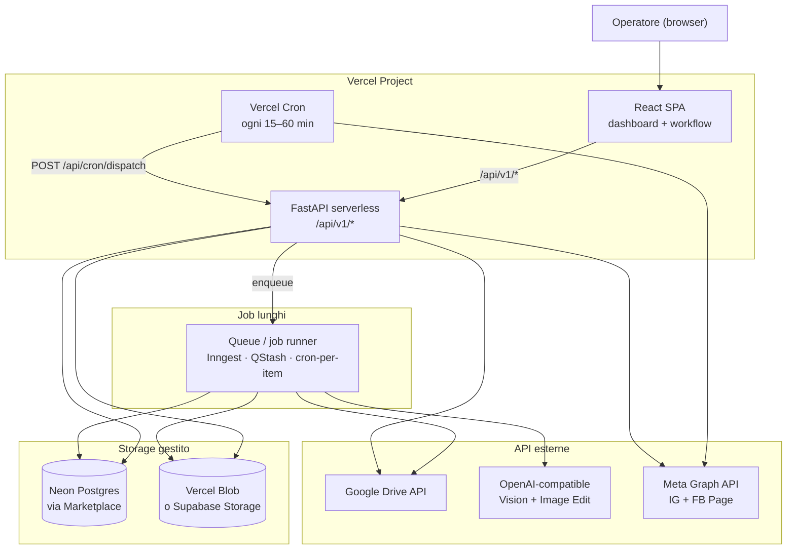

# 01 — Visione e architettura target

## Obiettivo

Portare **Social Media Automation** (Story Food & Drink) su Vercel mantenendo il workflow operativo:

```
Google Drive → Story AI → Approvazione → Pianificazione → Dispatch Meta
```

con accesso remoto via browser, senza dipendere da Docker locale, Tailscale o filesystem persistente sulla macchina host.

---

## Architettura target



---

## Componenti e responsabilità

| Componente | Tecnologia | Ruolo | Dove gira |
|------------|------------|-------|-----------|
| UI | React + TypeScript + Vite | Dashboard, wizard workflow | Vercel (static) |
| API | FastAPI (ASGI) | REST + SSE batch | Vercel (Python function) |
| DB | Neon Postgres | Stato immagini, batch, pianificazione | Neon (Marketplace) |
| Media | Vercel Blob / Supabase Storage | Originali, processed, thumbnail | Provider storage |
| Cron | Vercel Cron | `dispatch-scheduled` periodico | Vercel |
| Queue | Inngest / QStash / cron-per-item | Batch Story AI (1 foto per job) | Esterno o Vercel |
| Secrets | Vercel Sensitive Env Vars | Token Meta, Google, OpenAI | Vercel |
| Config | Repo `config/` | Brand, schedule, categories | Git (non segreti) |

---

## Cosa si abbandona

| Attuale (Docker/local) | Motivo | Sostituto |
|------------------------|--------|-----------|
| SQLite (`output/social_automation.db`) | Nessun disco persistente su Vercel | Neon Postgres |
| Filesystem `output/` | Effimero su serverless | Blob storage |
| Container `scheduler` (loop infinito) | Non supportato su Vercel | Vercel Cron |
| `subprocess.Popen` per batch | Non supportato | Job queue |
| `token.json`, `credentials.json` su disco | Non persistente | Env vars + DB |
| nginx reverse proxy | Gestito da Vercel | `vercel.json` rewrites |
| Tailscale come boundary | Non necessario con auth Vercel | Vercel Protection / Access |
| Streamlit (legacy) | Deprecato | Solo React |

---

## Cosa si conserva

| Modulo | Path sorgente | Note |
|--------|---------------|------|
| Frontend React | `frontend/` | Deploy statico, invariato |
| API routers | `src/social_automation/api/routers/` | Adattare deps (DB, storage) |
| Services | `src/social_automation/services/` | Logica business, refactor minimo |
| Scheduling | `src/social_automation/scheduling/` | Dispatch, slot planner |
| Meta client | `src/social_automation/meta/` | Invariato |
| Brand AI | `src/social_automation/brand/`, `visual/` | Invariato |
| Config YAML/MD | `config/` | Nel repo, non in `.env` |

---

## Flusso dati target

### 1. Selezione e batch AI

```
UI → POST /api/v1/batches/ai
  → crea record batch in Postgres
  → enqueue job per ogni asset Drive
  → worker: download Drive → AI → Pillow → upload Blob → update Postgres
  → UI polling/SSE su GET /api/v1/batches/{id}/events
```

### 2. Approvazione e pianificazione

```
UI → GET /api/v1/images/pending-approval
  → preview da URL Blob (non FileResponse locale)
UI → POST /api/v1/images/{id}/approval
UI → POST /api/v1/plans (slot da schedule.yaml)
  → planning_events in Postgres
  → (opz.) schedule nativo FB via Meta Graph API
```

### 3. Dispatch automatico

```
Vercel Cron (ogni 15–60 min)
  → POST /api/cron/dispatch (CRON_SECRET)
  → list_due_events + story_rules_dispatch
  → download immagine da Blob (temp /tmp)
  → publish via Meta Graph API
  → update planning_events in Postgres
```

---

## Vincoli Vercel da rispettare

| Vincolo | Limite (Pro) | Impatto |
|---------|--------------|---------|
| Function timeout | 300s default, 800s max, 1800s beta | Batch AI non può essere un unico job lungo |
| Bundle size Python | 500 MB | `onnxruntime` pesante — valutare rimozione o lazy load |
| Filesystem | Solo `/tmp`, non persistente | Tutto su Postgres + Blob |
| Subprocess | Non supportato | Queue al posto di `Popen` |
| SSE | Supportato ma con timeout function | Polling come fallback |
| Cron | Minimo 1 invocazione/giorno (Hobby), flessibile su Pro | OK per dispatch orario |

---

## Confronto architetture

| Aspetto | Attuale (Docker) | Target (Vercel) |
|---------|------------------|-----------------|
| Deploy | `docker compose up` | `vercel deploy` |
| DB | SQLite file | Neon Postgres |
| Immagini | `output/` locale | Blob URL |
| Scheduler | Container loop 10 min | Cron HTTP 15–60 min |
| Batch | Subprocess detached | Queue / 1 item per invocazione |
| OAuth | Desktop + localhost | Web callback + refresh in env/DB |
| Auth UI | Nessuna (Tailscale) | Vercel Protection o JWT |
| Costo infra | VPS/Docker host | Vercel Pro + Neon + Blob (~$20–50/mo) |
| Scaling | Manuale | Auto-scale Vercel functions |

---

## Prossimi passi

1. Leggere [02-analisi-gap](./02-analisi-gap-architettura-attuale.md) per il dettaglio dei blocchi
2. Seguire [10-roadmap-milestone](./10-roadmap-milestone.md) per l'ordine di implementazione
3. Consultare [11-decisioni-architetturali](./11-decisioni-architetturali.md) per le scelte aperte
