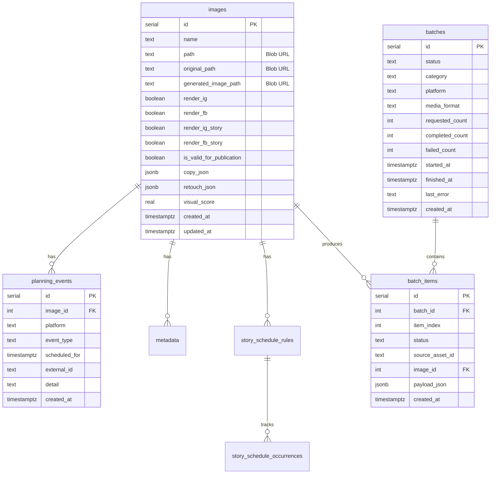

# 03 — Postgres: schema e migrazione

Piano per sostituire SQLite (`output/social_automation.db`) con **Neon Postgres** via Vercel Marketplace.

---

## Perché Postgres

| SQLite (attuale) | Postgres (target) |
|------------------|-------------------|
| File locale | Database cloud persistente |
| Un writer | Concorrenza multi-utente |
| Nessuna connessione remota | `DATABASE_URL` da Vercel env |
| Migrazioni runtime in Python | Schema versionato (SQL/Alembic) |
| Non compatibile Vercel | Compatibile serverless (Neon serverless driver) |

---

## Setup Neon su Vercel

1. Vercel Dashboard → Project → **Storage** → **Browse Marketplace**
2. Cerca **Neon** → **Install**
3. Scegli piano (Free per dev, Scale per prod)
4. Vercel inietta automaticamente:
   - `DATABASE_URL` (pooled, per runtime)
   - `DATABASE_URL_UNPOOLED` (per migrazioni)
   - `POSTGRES_URL`, `PGHOST`, `PGUSER`, ecc. (legacy)

### Driver Python consigliato

```toml
# pyproject.toml — aggiungere
dependencies = [
    "psycopg[binary,pool]>=3.2.0",
    # oppure
    "asyncpg>=0.30.0",
]
```

Per serverless con Neon, considerare connection pooling:
- **Runtime:** `DATABASE_URL` (pooled via PgBouncer/Neon)
- **Migrazioni:** `DATABASE_URL_UNPOOLED`

---

## Schema Postgres target

Lo schema completo è in [sql/001_initial_schema.sql](./sql/001_initial_schema.sql).

### Diagramma ER



---

## Mapping colonne SQLite → Postgres

### `images`

| SQLite | Postgres | Note |
|--------|----------|------|
| `INTEGER PRIMARY KEY AUTOINCREMENT` | `SERIAL PRIMARY KEY` | |
| `path TEXT` | `path TEXT` | Diventa Blob URL |
| `original_path TEXT` | `original_path TEXT` | Blob URL |
| `generated_image_path TEXT` | `generated_image_path TEXT` | Blob URL |
| `render_ig INTEGER` | `render_ig BOOLEAN` | `0/1` → `false/true` |
| `copy_json TEXT` | `copy_json JSONB` | Parse JSON nativo |
| `retouch_json TEXT` | `retouch_json JSONB` | Parse JSON nativo |
| `created_at TEXT` | `created_at TIMESTAMPTZ` | ISO → timezone-aware |
| `is_valid_for_publication INTEGER NULL` | `is_valid_for_publication BOOLEAN` | Tri-state: NULL = pending |

### `planning_events`

| SQLite | Postgres | Note |
|--------|----------|------|
| `scheduled_for TEXT` | `scheduled_for TIMESTAMPTZ` | |
| `julianday()` confronti | `scheduled_for <= $1` | Query nativa |

### `batches`

| SQLite | Postgres | Note |
|--------|----------|------|
| `runner_pid INTEGER` | *(rimosso)* | Non serve con queue |
| `stop_requested_at TEXT` | `stop_requested_at TIMESTAMPTZ` | |
| `media_format TEXT` | `media_format TEXT` | |

### `batch_items`

| SQLite | Postgres | Note |
|--------|----------|------|
| `payload_json TEXT` | `payload_json JSONB` | |
| `INSERT OR REPLACE` | `ON CONFLICT DO UPDATE` | |

---

## Query critiche da riscrivere

### `list_due_events` (dispatch)

**SQLite (attuale):**
```sql
AND julianday(r.scheduled_for) <= julianday(?)
```

**Postgres (target):**
```sql
AND r.scheduled_for <= $1::timestamptz
```

### `story_schedule_occurrences` insert

**SQLite:**
```sql
INSERT OR IGNORE INTO story_schedule_occurrences(rule_id, occurrence_date) VALUES (?, ?)
```

**Postgres:**
```sql
INSERT INTO story_schedule_occurrences (rule_id, occurrence_date)
VALUES ($1, $2)
ON CONFLICT (rule_id, occurrence_date) DO NOTHING
```

### Upsert batch item

**SQLite:**
```sql
INSERT OR REPLACE INTO batch_items(...) VALUES (...)
```

**Postgres:**
```sql
INSERT INTO batch_items (batch_id, item_index, status, ...)
VALUES ($1, $2, $3, ...)
ON CONFLICT (batch_id, item_index) DO UPDATE SET
  status = EXCLUDED.status,
  ...
```

---

## Piano di migrazione codice

### Fase 1 — Adapter pattern (minimo rischio)

Creare un'interfaccia repository che astrae il DB:

```
src/social_automation/db/
├── __init__.py
├── interface.py      # Protocol/ABC con tutti i metodi di store.py
├── sqlite_store.py   # Implementazione attuale (dev locale)
└── postgres_store.py # Nuova implementazione
```

`settings.py` aggiunge:
```python
database_url: str = Field(default="", description="DATABASE_URL Postgres")
db_backend: str = Field(default="sqlite", description="sqlite | postgres")
```

### Fase 2 — Refactor deps

```python
# api/deps.py (target)
def get_db(settings: SettingsDep) -> Database:
    if settings.db_backend == "postgres":
        return PostgresDatabase(settings.database_url)
    return SqliteDatabase(settings.db_path)
```

### Fase 3 — Cutover

1. Deploy con `db_backend=postgres` su staging
2. Migrare dati da SQLite (se necessario)
3. Rimuovere `sqlite_store.py` quando stabile

### Alternativa: SQLAlchemy

Se il team preferisce un ORM:

```python
# Modelli SQLAlchemy 2.0 per le 7 tabelle
# Alembic per migrazioni versionate
# Pro: tooling, migrazioni, type safety
# Contro: refactor più ampio (~2 settimane extra)
```

**Raccomandazione:** adapter pattern per M1, valutare SQLAlchemy in M3.

---

## Migrazione dati (SQLite → Postgres)

### Script one-shot

```bash
# Eseguire in locale con entrambi i DB accessibili
python scripts/migrate_sqlite_to_postgres.py \
  --sqlite output/social_automation.db \
  --postgres "$DATABASE_URL_UNPOOLED"
```

### Mapping path → Blob URL

Durante la migrazione dati, i path locali in `images.path` vanno:
1. Uploadati su Blob storage
2. Sostituiti con URL Blob nel record Postgres

Ordine:
```
1. Export SQLite → JSON
2. Per ogni immagine: upload file → ottieni Blob URL
3. Import in Postgres con URL aggiornati
4. Verifica conteggi e integrità FK
```

### Cosa NON migrare

| Dato | Motivo |
|------|--------|
| `output/batch_queues/*.json` | Stato transiente, rigenerabile |
| `output/logs/*.log` | Log storici, non critici |
| Batch `running` al momento della migrazione | Marcare `failed`, riavviare |

---

## Indici consigliati

```sql
-- Già nel schema iniziale, ma da monitorare in prod:
CREATE INDEX idx_planning_events_due
  ON planning_events (scheduled_for, event_type, platform);

CREATE INDEX idx_images_approval
  ON images (is_valid_for_publication, created_at DESC);

CREATE INDEX idx_batches_status
  ON batches (status, created_at DESC);
```

---

## Test

### Strategia

1. **Test esistenti** (`tests/test_db_store.py`) — eseguire contro Postgres con fixture `DATABASE_URL` test
2. **Contract test** — stessi input/output tra sqlite e postgres adapter
3. **Integration test** — deploy preview Vercel con Neon branch

### Fixture test

```python
# tests/conftest.py (target)
@pytest.fixture
def db_backend(request):
    if os.getenv("TEST_DATABASE_URL"):
        return PostgresDatabase(os.environ["TEST_DATABASE_URL"])
    return SqliteDatabase(tmp_path / "test.db")
```

Neon supporta **branch per preview deployment** — ogni PR Vercel ottiene un DB isolato.

---

## Checklist migrazione DB

- [ ] Installare Neon da Vercel Marketplace
- [ ] Eseguire `sql/001_initial_schema.sql` su `DATABASE_URL_UNPOOLED`
- [ ] Implementare `postgres_store.py` con parità funzionale
- [ ] Aggiornare `api/deps.py` per backend switch
- [ ] Riscrivere query con `julianday`, `INSERT OR IGNORE`, ecc.
- [ ] Test pytest contro Postgres
- [ ] Script migrazione dati (se DB produzione esistente)
- [ ] Upload immagini su Blob durante migrazione
- [ ] Verificare dispatch `list_due_events` con timestamp TZ
- [ ] Rimuovere dipendenza `sqlite3` dal path critico
