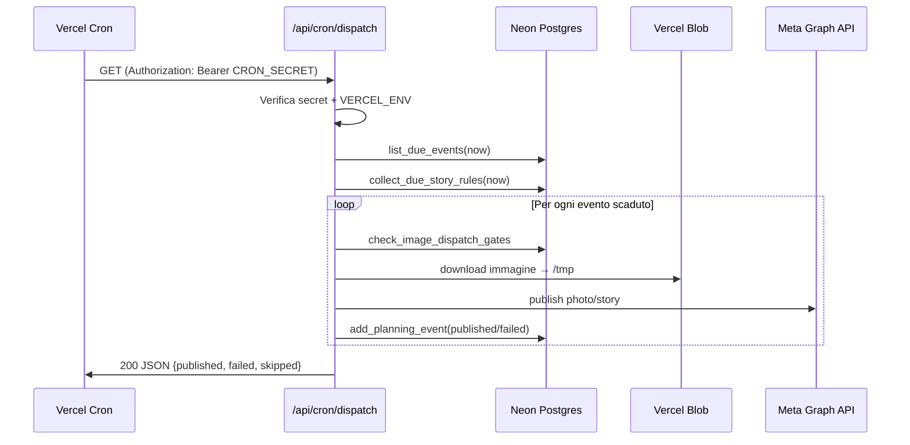

# 07 — Cron dispatch Meta

Sostituzione del container Docker `scheduler` con **Vercel Cron** per la pubblicazione automatica su Instagram e Facebook.

---

## Cosa fa il dispatch

Il dispatch pubblica contenuti la cui data/ora pianificata è scaduta:

1. **Post pianificati** — eventi in `planning_events` con `scheduled_for <= now`
2. **Regole story ricorrenti** — `story_schedule_rules` con occorrenze dovute

Logica esistente (invariata):
- `services/dispatch.py` → `scheduling/dispatch_runner.py`
- Gate: approvazione, qualità ONNX (opz.), vision brand
- Publish via `MetaClient` (Graph API)

---

## Architettura cron



---

## Configurazione Vercel Cron

### `vercel.json`

```json
{
  "crons": [
    {
      "path": "/api/cron/dispatch",
      "schedule": "*/15 * * * *"
    }
  ]
}
```

### Scelta frequenza

| Schedule | Cron expression | Ritardo max | Raccomandazione |
|----------|-----------------|-------------|-----------------|
| Ogni ora | `0 * * * *` | 60 min | Accettabile per post non time-critical |
| Ogni 15 min | `*/15 * * * *` | 15 min | **Consigliato** |
| Ogni 5 min | `*/5 * * * *` | 5 min | Ideale, richiede piano Pro |
| Ogni 10 min (attuale Docker) | `*/10 * * * *` | 10 min | Parità con setup attuale |

> **Nota:** Instagram non supporta scheduling nativo via Graph API per tutti i tipi di contenuto. Il progetto usa il pattern "salva nel DB + dispatch all'orario" (vedi `docs/instagram_graph_api_scheduler_notes.md` nel repo sorgente). La precisione del cron è quindi importante.

---

## Endpoint cron

### Requisiti di sicurezza

1. Verificare `Authorization: Bearer {CRON_SECRET}`
2. Verificare `VERCEL_ENV == "production"` (non eseguire su preview)
3. Rispondere entro il timeout function (120s)
4. Essere **idempotente** — ripubblicare lo stesso evento non deve creare duplicati

### Implementazione (FastAPI router)

```python
# api/routers/cron.py
import os
from fastapi import APIRouter, Header, HTTPException

router = APIRouter(prefix="/cron", tags=["cron"])

@router.get("/dispatch")
def cron_dispatch(
    authorization: str | None = Header(None),
):
    # 1. Solo production
    if os.getenv("VERCEL_ENV", "development") != "production":
        raise HTTPException(403, "Cron only runs in production")

    # 2. Verifica secret
    secret = os.getenv("CRON_SECRET", "")
    if not secret:
        raise HTTPException(500, "CRON_SECRET not configured")
    expected = f"Bearer {secret}"
    if authorization != expected:
        raise HTTPException(401, "Unauthorized")

    # 3. Esegui dispatch
    from social_automation.services.dispatch import run_dispatch
    settings = load_settings()
    db = get_database(settings)

    result = run_dispatch(
        db,
        limit=int(os.getenv("DISPATCH_LIMIT", "100")),
        settings=settings,
    )
    return {"ok": True, **result}
```

### Vercel Cron — come invoca l'endpoint

Vercel Cron fa una richiesta **GET** all'URL configurato. Non invia automaticamente l'header `Authorization`. Opzioni:

| Opzione | Pro | Contro |
|---------|-----|--------|
| **A) Query param** `?secret=...` | Semplice | Secret in URL (loggato) |
| **B) Header via Vercel Cron secret** | Più sicuro | Richiede config avanzata |
| **C) `CRON_SECRET` in env + check IP Vercel** | Medio | IP Vercel non garantiti |

**Raccomandazione:** usare **query param** per semplicità iniziale, poi migrare a header custom quando Vercel lo supporta nativamente. Alternativa: endpoint protetto da Vercel Deployment Protection con bypass token.

```python
# Alternativa con query param
@router.get("/dispatch")
def cron_dispatch(secret: str = Query(...)):
    if secret != os.getenv("CRON_SECRET"):
        raise HTTPException(401)
    ...
```

---

## Idempotenza

Il dispatch attuale è già idempotente per design:

1. `list_due_events` seleziona solo eventi il cui **ultimo stato** è `planned`/`rescheduled` e `scheduled_for <= now`
2. Dopo publish riuscito, viene aggiunto un evento `published` → l'evento non appare più come "due"
3. Story rules: `story_schedule_occurrences` traccia occorrenze già pubblicate

### Protezione aggiuntiva (consigliata)

```sql
-- Tabella opzionale per audit cron
CREATE TABLE IF NOT EXISTS cron_runs (
    id SERIAL PRIMARY KEY,
    run_type TEXT NOT NULL DEFAULT 'dispatch',
    started_at TIMESTAMPTZ NOT NULL DEFAULT NOW(),
    finished_at TIMESTAMPTZ,
    published_count INT DEFAULT 0,
    failed_count INT DEFAULT 0,
    skipped_count INT DEFAULT 0,
    error TEXT,
    vercel_deployment_id TEXT
);
```

---

## Gate dispatch

Variabili env (invariate dal setup attuale):

| Variabile | Default | Effetto |
|-----------|---------|---------|
| `DISPATCH_REQUIRE_APPROVAL` | `true` | Solo `is_valid_for_publication = true` |
| `DISPATCH_REQUIRE_QUALITY_PASS` | `false` | Gate ONNX (disabilitato su Vercel) |
| `DISPATCH_REQUIRE_VISION_PASS` | `true` | Gate vision brand |
| `DISPATCH_LIMIT` | `100` | Max eventi per esecuzione cron |
| `DISPATCH_PLATFORM` | *(vuoto)* | Filtra per `instagram` o `facebook` |

---

## Dispatch manuale (invariato)

Oltre al cron, il dispatch resta disponibile:

| Canale | Endpoint/Comando |
|--------|-------------------|
| UI React | Pagina **⑤ Pubblica** → `POST /api/v1/dispatch/run` |
| API | `POST /api/v1/dispatch/dry-run` (anteprima) |
| API | `GET /api/v1/dispatch/due` (eventi scaduti) |

### Regola: un solo scheduler

> **Importante:** non eseguire contemporaneamente il cron Vercel e un scheduler Docker/launchd. Rischio doppia pubblicazione.

---

## Token Meta e refresh

Il cron usa `META_PAGE_ACCESS_TOKEN` dall'env Vercel. Considerazioni:

| Aspetto | Dettaglio |
|---------|-----------|
| Scadenza Page token | ~60 giorni (long-lived) |
| Refresh | `meta-refresh-page-token` con user token |
| Strategia | Cron separato mensile per refresh, oppure System User (Business Manager) |

### Cron refresh token (opzionale, mensile)

```json
{
  "crons": [
    { "path": "/api/cron/dispatch", "schedule": "*/15 * * * *" },
    { "path": "/api/cron/refresh-meta-token", "schedule": "0 3 1 * *" }
  ]
}
```

---

## Test

### Test manuale (pre-produzione)

```bash
# Dry-run via API
curl -X POST https://your-app.vercel.app/api/v1/dispatch/dry-run \
  -H "Content-Type: application/json" \
  -d '{"limit": 10}'

# Cron endpoint (con secret)
curl "https://your-app.vercel.app/api/cron/dispatch?secret=$CRON_SECRET"
```

### Test con evento scaduto

1. Pianificare un post per 2 minuti nel futuro
2. Attendere scadenza
3. Verificare che il cron successivo lo pubblichi
4. Controllare `planning_events` → evento `published` con `external_id`

### Checklist test dispatch

- [ ] Dry-run restituisce eventi corretti
- [ ] Gate approvazione blocca immagini non approvate
- [ ] Publish IG funziona (con `META_IG_USER_ID`)
- [ ] Publish FB funziona
- [ ] Story dispatch funziona
- [ ] Story rules ricorrenti generano occorrenze
- [ ] Evento già pubblicato non viene ripubblicato
- [ ] Cron risponde entro 120s con 50 eventi
- [ ] Log cron visibili in Vercel Dashboard

---

## Monitoring cron

### Vercel Dashboard

**Settings → Cron Jobs** mostra:
- Ultima esecuzione
- Status code
- Durata
- Log della function

### Alerting

Se il cron fallisce (non-200), Vercel logga l'errore. Per alerting proattivo:
- Monitor esterno su `GET /api/v1/health`
- Webhook Slack su deploy/cron failure (Vercel Integration)

---

## Checklist cron

- [ ] `CRON_SECRET` generato e configurato su Vercel
- [ ] Endpoint `/api/cron/dispatch` implementato
- [ ] `vercel.json` con schedule scelto
- [ ] `maxDuration: 120` per endpoint cron
- [ ] Verifica `VERCEL_ENV == production`
- [ ] `META_PAGE_ACCESS_TOKEN` valido
- [ ] `META_IG_USER_ID` configurato
- [ ] Scheduler Docker disattivato
- [ ] Test dry-run OK
- [ ] Test publish reale su account test
- [ ] Monitoring attivo
