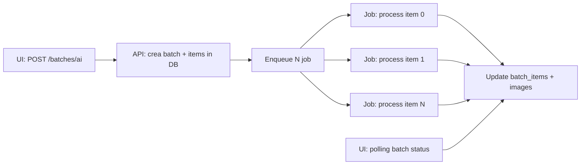

# 08 — Batch AI e job queue

Piano per sostituire il sistema di batch attuale (`subprocess.Popen` + worker detached) con un'architettura compatibile Vercel.

---

## Problema attuale

```
POST /api/v1/batches/ai
  → create_batch() in DB
  → write output/batch_queues/{id}.json
  → subprocess.Popen(selected_ai_batch_runner)  ← NON funziona su Vercel
  → worker processa N foto sequenzialmente (1–5 min/foto)
  → SSE GET /api/v1/batches/{id}/events
```

### Perché non funziona su Vercel

| Vincolo | Dettaglio |
|---------|-----------|
| No subprocess | `Popen(start_new_session=True)` non supportato |
| Timeout | 10 foto × 3 min = 30 min >> max function duration |
| No processo background | La function termina alla risposta HTTP |
| SSE long-lived | Function resta aperta = costo + timeout |
| Filesystem | Queue JSON su disco non persistente |

---

## Architettura target



### Principio: 1 foto = 1 job

Ogni asset Drive selezionato diventa un job indipendente. Non c'è un "worker" long-running — ogni job è una function invocation separata.

---

## Opzioni di implementazione

### Opzione A — Vercel Cron + self-queue (semplice, zero dipendenze)

```
POST /batches/ai → crea batch (status=running) + batch_items (status=queued)
Cron ogni 1 min → POST /api/cron/process-batch
  → prende prossimo batch_item con status=queued
  → processa 1 foto
  → aggiorna status
  → se tutti done → batch status=completed
```

| Pro | Contro |
|-----|--------|
| Zero servizi esterni | Latenza tra foto (1 min gap) |
| Tutto su Vercel | Cron non garantisce esecuzione immediata |
| Semplice da debuggare | Max 1 foto/minuto |

**Adatto per:** batch piccoli (1–5 foto), uso non urgente.

### Opzione B — Inngest (consigliata per produzione)

```
POST /batches/ai → crea batch + items
  → inngest.send("batch/process-item", {batch_id, item_index})
Inngest worker → processa ogni item
  → al completamento, invia evento per item successivo
  → UI polling su batch status
```

| Pro | Contro |
|-----|--------|
| Esecuzione immediata | Servizio esterno (free tier generoso) |
| Retry automatico | SDK principalmente TypeScript |
| Osservabilità built-in | Setup aggiuntivo |
| Python support via HTTP | — |

**Adatto per:** batch medi (5–20 foto), produzione.

### Opzione C — Upstash QStash (leggero)

```
POST /batches/ai → crea batch + items
  → per ogni item: qstash.publish("/api/jobs/process-item", {batch_id, item_index})
/api/jobs/process-item → processa 1 foto (maxDuration: 300)
```

| Pro | Contro |
|-----|--------|
| HTTP-based, Python-friendly | Meno features di Inngest |
| Pay-per-message | Retry manuale |
| Integrazione Vercel Marketplace | — |

**Adatto per:** batch medi, preferenza per HTTP puro.

### Raccomandazione

| Fase | Scelta |
|------|--------|
| M1 (MVP) | **Opzione A** — cron self-queue |
| M2 (produzione) | **Opzione C** — QStash |
| M3 (se serve orchestrazione complessa) | **Opzione B** — Inngest |

Vedi [11-decisioni-architetturali.md](./11-decisioni-architetturali.md).

---

## Implementazione — Opzione A (cron self-queue)

### Schema DB (già esistente, adattato)

```sql
-- batch_items.status: queued → running → completed | failed
-- batches.status: running → completed | failed
```

### API: avvio batch (modificato)

```python
# services/batch_runner.py (target)
def start_selected_ai_batch(settings, *, category, platform, media_format, assets, ...):
    batch_id = create_batch(db, ...)
    for i, asset in enumerate(assets):
        add_batch_item(
            db,
            batch_id=batch_id,
            item_index=i,
            status="queued",
            source_asset_id=asset["file_id"],
            source_asset_name=asset["name"],
            payload_json=asset,
        )
    # NON subprocess — il cron processerà gli item
    return batch_id
```

### Cron: processa prossimo item

```python
# api/cron/process_batch.py
def cron_process_batch():
    item = db.get_next_queued_batch_item()
    if item is None:
        return {"ok": True, "message": "Nessun item in coda"}

    batch_id = item["batch_id"]
    db.update_batch_item(item["id"], status="running")

    try:
        result = process_drive_asset(
            asset=DriveAsset(**item["payload_json"]),
            platform=...,
            media_format=...,
            auto_approve=False,
        )
        db.update_batch_item(item["id"], status="completed", image_id=result["image_id"])
    except Exception as exc:
        db.update_batch_item(item["id"], status="failed", error_message=str(exc))
        db.increment_batch_failed(batch_id)

    db.update_batch_progress(batch_id)
    if db.is_batch_complete(batch_id):
        db.finalize_batch(batch_id, status="completed")

    return {"ok": True, "batch_id": batch_id, "item_index": item["item_index"]}
```

### `vercel.json` — cron aggiuntivo

```json
{
  "crons": [
    { "path": "/api/cron/dispatch", "schedule": "*/15 * * * *" },
    { "path": "/api/cron/process-batch", "schedule": "* * * * *" }
  ]
}
```

---

## Implementazione — Opzione C (QStash)

### Setup

```bash
vercel install upstash-qstash
# Inietta: QSTASH_TOKEN, QSTASH_CURRENT_SIGNING_KEY, QSTASH_NEXT_SIGNING_KEY
```

### Enqueue

```python
import httpx

async def enqueue_batch_item(batch_id: int, item_index: int):
    async with httpx.AsyncClient() as client:
        await client.post(
            "https://qstash.upstash.io/v2/publish/https://your-app.vercel.app/api/jobs/process-item",
            headers={
                "Authorization": f"Bearer {QSTASH_TOKEN}",
                "Content-Type": "application/json",
            },
            json={"batch_id": batch_id, "item_index": item_index},
        )
```

### Worker endpoint

```python
# api/jobs/process_item.py
@app.post("/api/jobs/process-item")
def process_item(body: ProcessItemRequest, request: Request):
    verify_qstash_signature(request)  # Sicurezza
    # ... stessa logica di process_drive_asset ...
```

---

## Processamento singola foto

Il core di `process_drive_asset` resta invariato, con adattamenti per Blob:

```python
# workflow/process_photo.py — flusso per 1 foto
def process_drive_asset(asset, *, platform, media_format, settings, auto_approve=False):
    # 1. Download da Drive API
    # 2. Upload originale su Blob
    # 3. Story AI (retouch + copy) — 1-3 min
    # 4. Upload processed su Blob
    # 5. Salva in Postgres (images + metadata)
    # 6. auto_approve=False → is_valid_for_publication = NULL
    return {"image_id": ..., "blob_url": ...}
```

### Timeout per singola foto

| Step | Durata stimata |
|------|----------------|
| Download Drive | 1–5s |
| AI retouch (Vision) | 10–30s |
| AI copy | 5–15s |
| Pillow processing | 1–3s |
| Upload Blob | 1–3s |
| DB write | <1s |
| **Totale** | **~30–60s** |

Con `maxDuration: 300` c'è margine sufficiente per 1 foto, anche con retry.

---

## Monitoraggio batch nella UI

### SSE → Polling (semplice e affidabile)

```typescript
// frontend — polling ogni 3s mentre batch è running
const { data } = useQuery({
  queryKey: ["batch", batchId],
  queryFn: () => fetchBatchDetail(batchId),
  refetchInterval: (query) =>
    query.state.data?.batch.status === "running" ? 3000 : false,
});
```

### SSE (opzionale, se maxDuration lo permette)

Mantenere `GET /api/v1/batches/{id}/events` con polling server-side ogni 2s, ma con timeout function adeguato. Il polling client-side è più semplice e robusto su Vercel.

### Stato batch nella UI

| Status | Significato | UI |
|--------|-------------|-----|
| `running` | Item in elaborazione | Progress bar |
| `completed` | Tutti gli item OK | Successo |
| `failed` | Almeno 1 item fallito | Errore + dettaglio |
| `stopped` | Stop manuale richiesto | Warning |

---

## Stop batch

```python
# POST /api/v1/batches/{id}/stop (invariato)
def stop_batch(db, batch_id, reason):
    db.update_batch(batch_id, stop_requested_at=now(), stop_reason=reason)
    # Il cron/qstash skip item con stop_requested
```

---

## Confronto con architettura attuale

| Aspetto | Attuale (subprocess) | Target (queue) |
|---------|---------------------|----------------|
| Avvio | `Popen` immediato | Enqueue + cron/worker |
| Parallelismo | Sequenziale (1 foto) | Sequenziale (1 foto per job) |
| Durata batch 10 foto | ~30 min in 1 processo | ~10 min (1 foto/min con cron) |
| Crash recovery | Batch stuck `running` | Item `failed`, batch continua |
| Log | `output/logs/batch-N.log` | Vercel function logs |
| PID tracking | `runner_pid` in DB | Rimosso |
| Queue file | `output/batch_queues/N.json` | `batch_items` in Postgres |

---

## Checklist batch

- [ ] Rimuovere `subprocess.Popen` da `batch_runner.py`
- [ ] Stato `queued` per batch_items
- [ ] Implementare cron o QStash per processare item
- [ ] `process_drive_asset` adattato per Blob + Postgres
- [ ] `maxDuration: 300` per endpoint process-item
- [ ] Polling UI (o SSE con timeout)
- [ ] Stop batch funzionante
- [ ] Test batch 1 foto end-to-end
- [ ] Test batch 5 foto
- [ ] Test recovery dopo failure singolo item
- [ ] Rimuovere `runner_pid`, queue file JSON, log file
