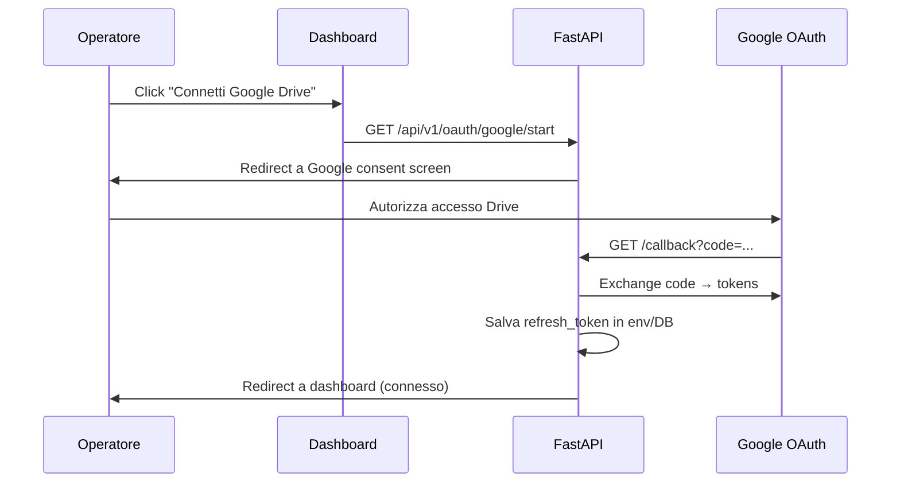

# 09 — OAuth e autenticazione

Piano per adattare l'autenticazione Google Drive, Meta e la protezione della dashboard al deploy su Vercel.

---

## Panoramica

| Area | Attuale | Target Vercel |
|------|---------|---------------|
| Google Drive | OAuth Desktop + `token.json` | OAuth Web + refresh token in env |
| Meta Page token | OAuth localhost:8765 + file | Token in Vercel env (setup one-shot) |
| Dashboard UI | Nessuna auth (Tailscale) | Vercel Protection o login |
| API | Nessuna auth | API key o JWT (opzionale) |

---

## 1. Google Drive OAuth

### Problema attuale

```python
# drive/auth.py
flow = InstalledAppFlow.from_client_secrets_file("credentials.json", SCOPES)
creds = flow.run_local_server(port=0)  # Browser locale
token_path.write_text(creds.to_json())  # Salva su disco
```

Non funziona su Vercel: niente browser locale, niente file persistente.

### Soluzione: OAuth Web Application

#### Setup Google Cloud Console

1. Creare progetto (o usare quello esistente)
2. **APIs & Services → Credentials → Create OAuth Client ID**
3. Tipo: **Web application** (non Desktop)
4. Authorized redirect URIs:
   ```
   https://your-app.vercel.app/api/v1/oauth/google/callback
   http://localhost:8000/api/v1/oauth/google/callback  (dev)
   ```
5. Scaricare JSON client → convertire in `GOOGLE_CREDENTIALS_JSON` env var

#### Flusso OAuth web



#### Implementazione

```python
# api/routers/oauth_google.py
from google_auth_oauthlib.flow import Flow

REDIRECT_URI = os.getenv("GOOGLE_REDIRECT_URI",
    "https://your-app.vercel.app/api/v1/oauth/google/callback")

@router.get("/start")
def google_oauth_start():
    credentials_json = json.loads(os.environ["GOOGLE_CREDENTIALS_JSON"])
    flow = Flow.from_client_config(
        credentials_json,
        scopes=["https://www.googleapis.com/auth/drive.readonly"],
        redirect_uri=REDIRECT_URI,
    )
    auth_url, state = flow.authorization_url(access_type="offline", prompt="consent")
    # Salva state in session/cookie per CSRF protection
    return RedirectResponse(auth_url)

@router.get("/callback")
def google_oauth_callback(code: str, state: str):
    # Verifica state, exchange code
    flow.fetch_token(code=code)
    refresh_token = flow.credentials.refresh_token
    # Salva in DB (tabella oauth_tokens) o aggiorna env via Vercel API
    return RedirectResponse("/?google=connected")
```

#### Storage refresh token

| Opzione | Pro | Contro |
|---------|-----|--------|
| **Env var** `GOOGLE_REFRESH_TOKEN` | Semplice | Aggiornamento manuale se scade |
| **Tabella DB** `oauth_tokens` | Aggiornabile via API | Più codice |
| **Vercel env via API** | Centralizzato | Complesso |

**Raccomandazione:** tabella `oauth_tokens` in Postgres per flessibilità.

```sql
CREATE TABLE oauth_tokens (
    id SERIAL PRIMARY KEY,
    provider TEXT NOT NULL UNIQUE,  -- 'google_drive'
    refresh_token TEXT NOT NULL,
    access_token TEXT,
    expires_at TIMESTAMPTZ,
    updated_at TIMESTAMPTZ DEFAULT NOW()
);
```

#### Alternativa: Service Account

Se la cartella Drive è condivisa con un service account:

```python
from google.oauth2 import service_account

creds = service_account.Credentials.from_service_account_info(
    json.loads(os.environ["GOOGLE_SERVICE_ACCOUNT_JSON"]),
    scopes=["https://www.googleapis.com/auth/drive.readonly"],
)
```

| Pro | Contro |
|-----|--------|
| Nessun OAuth interattivo | Cartella Drive deve essere condivisa esplicitamente |
| Token non scade | Meno flessibile per cambio account |
| Ideale per automazione | Non funziona con Drive personale |

**Raccomandazione:** Service Account se possibile (meno manutenzione), OAuth Web come fallback.

---

## 2. Meta OAuth / Page Token

### Situazione attuale

- `meta-oauth-page-token` avvia server HTTP su `127.0.0.1:8765`
- Operatore autorizza nel browser → Page token salvato su file
- Il dispatch usa il token dall'env o dal file

### Strategia per Vercel

**Setup one-shot in locale, poi token in Vercel env:**

```bash
# 1. In locale (una tantum)
python -m social_automation meta-oauth-page-token --write-token-file /tmp/meta_token.txt

# 2. Copiare il token
cat /tmp/meta_token.txt

# 3. Aggiungere su Vercel
vercel env add META_PAGE_ACCESS_TOKEN production --sensitive
```

### Refresh periodico

| Metodo | Frequenza | Come |
|--------|-----------|------|
| `meta-refresh-page-token` | Mensile | Cron Vercel dedicato |
| System User (Business Manager) | Token non scade | Setup in Meta Business Manager |
| Ri-OAuth manuale | ~60 giorni | Rifare step one-shot |

**Raccomandazione a lungo termine:** System User in Business Manager (zero manutenzione).

### OAuth Meta web (opzionale, futuro)

Se si vuole OAuth Meta direttamente dalla dashboard:

```
Redirect URI: https://your-app.vercel.app/api/v1/oauth/meta/callback
```

Simile al flusso Google, ma con le specificità Meta (scope `pages_manage_posts`, ecc.).

---

## 3. Autenticazione dashboard

### Opzioni (in ordine di semplicità)

| # | Meccanismo | Complessità | Sicurezza | Note |
|---|------------|-------------|-----------|------|
| 1 | **Vercel Password Protection** | Minima | Media | Password condivisa, zero codice |
| 2 | **Vercel Authentication (SSO)** | Bassa | Alta | Google/GitHub login, piano Pro |
| 3 | **Cloudflare Access** | Media | Alta | Se si usa Cloudflare come DNS |
| 4 | **API Key header** | Bassa | Media | Per API, non per UI |
| 5 | **JWT in FastAPI** | Alta | Alta | Login form custom, utenti in DB |

### Raccomandazione per fase 1

**Vercel Password Protection** (Settings → Deployment Protection):

- Zero codice
- Password condivisa tra i 2 operatori
- Protegge sia frontend che API
- Il cron Vercel bypassa la protection (invocazione interna)

### Raccomandazione per fase 2

**Vercel Authentication** con Google SSO:
- Login con account Google autorizzato
- Nessuna password condivisa
- Integrazione nativa

### Protezione endpoint cron

Il cron **non deve** passare per Password Protection. Vercel Cron invoca direttamente la function. Protezione via `CRON_SECRET` (vedi [07-cron-dispatch-meta.md](./07-cron-dispatch-meta.md)).

### Protezione endpoint job (QStash)

Se si usa QStash, verificare la firma:

```python
from qstash import Receiver
receiver = Receiver(
    current_signing_key=os.environ["QSTASH_CURRENT_SIGNING_KEY"],
    next_signing_key=os.environ["QSTASH_NEXT_SIGNING_KEY"],
)
receiver.verify(body=request.body, signature=request.headers["Upstash-Signature"])
```

---

## 4. CORS

```python
# api/main.py
cors_origins = os.getenv("API_CORS_ORIGINS", "http://localhost:5173")
# Production: "https://your-app.vercel.app"
```

Con Password Protection, le richieste API dal frontend passano dallo stesso dominio → CORS non è un problema in produzione (same-origin via rewrites).

---

## Flusso setup iniziale (runbook)

### Prima installazione

```
1. Deploy su Vercel (senza token)
2. Abilitare Password Protection
3. Setup Google:
   a. Service Account (preferito) → GOOGLE_SERVICE_ACCOUNT_JSON in env
   b. Oppure OAuth Web → click "Connetti Drive" nella dashboard
4. Setup Meta:
   a. In locale: meta-oauth-page-token
   b. Copiare token → META_PAGE_ACCESS_TOKEN in Vercel env
5. Setup OpenAI:
   a. VISION_API_KEY in Vercel env
6. Test:
   a. Health check
   b. Listing Drive
   c. Batch 1 foto
   d. Dispatch dry-run
```

### Rinnovo token Meta (ogni ~60 giorni)

```
1. In locale: meta-refresh-page-token (con META_USER_ACCESS_TOKEN)
   oppure: meta-oauth-page-token (nuovo OAuth)
2. Aggiornare META_PAGE_ACCESS_TOKEN su Vercel
3. Verificare dispatch dry-run
```

---

## Checklist OAuth e auth

- [ ] Creare OAuth Web client su Google Cloud Console
- [ ] `GOOGLE_CREDENTIALS_JSON` o `GOOGLE_SERVICE_ACCOUNT_JSON` in Vercel env
- [ ] Implementare `/api/v1/oauth/google/start` e `/callback` (se OAuth Web)
- [ ] Oppure: condividere cartella Drive con service account
- [ ] `META_PAGE_ACCESS_TOKEN` configurato (setup one-shot locale)
- [ ] Vercel Password Protection abilitata
- [ ] `CRON_SECRET` per protezione cron
- [ ] `API_CORS_ORIGINS` configurato
- [ ] Test: login dashboard → listing Drive → batch → dispatch
- [ ] Documentare procedura rinnovo token Meta
- [ ] (Futuro) System User Meta per token permanente
- [ ] (Futuro) Vercel Authentication con Google SSO
