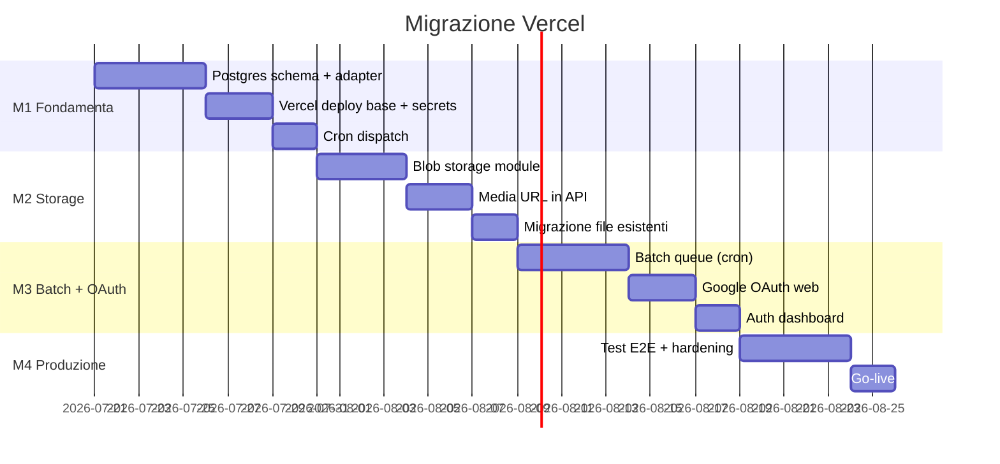

# 10 — Roadmap e milestone

Piano di implementazione per la migrazione da Docker/SQLite a Vercel-native.

**Stima totale:** 4–7 settimane (1 sviluppatore)  
**Team:** 1 dev full-stack familiarità con codebase

---

## Panoramica milestone



---

## M1 — Fondamenta cloud (settimana 1–2)

### Obiettivo

Deploy funzionante con Postgres, cron dispatch, dashboard read-only.

### Task

| # | Task | Priorità | Effort | Output |
|---|------|----------|--------|--------|
| 1.1 | Creare repo `social-media-automation-vercel` | P0 | 2h | Repo con struttura target |
| 1.2 | Copiare `frontend/`, `src/`, `config/` dal repo sorgente | P0 | 2h | Codebase base |
| 1.3 | Installare Neon da Vercel Marketplace | P0 | 1h | `DATABASE_URL` iniettato |
| 1.4 | Eseguire `sql/001_initial_schema.sql` | P0 | 1h | Tabelle Postgres |
| 1.5 | Implementare `db/postgres_store.py` | P0 | 3d | Adapter Postgres |
| 1.6 | Refactor `api/deps.py` per backend switch | P0 | 4h | `DB_BACKEND` env |
| 1.7 | Riscrivere query SQLite-specifiche | P0 | 1d | Query Postgres |
| 1.8 | Test pytest contro Postgres | P0 | 1d | Test verdi |
| 1.9 | Configurare `vercel.json` + `api/index.py` | P0 | 4h | Deploy funzionante |
| 1.10 | Configurare secrets (doc 05) | P0 | 2h | Env vars su Vercel |
| 1.11 | Implementare `/api/cron/dispatch` | P0 | 4h | Cron funzionante |
| 1.12 | Deploy Production + Password Protection | P1 | 2h | URL live |

### Criteri di accettazione M1

- [ ] `GET /api/v1/health` → 200 su Vercel
- [ ] `GET /api/v1/dashboard/stats` → metriche da Postgres
- [ ] Cron dispatch esegue senza errori (dry-run o 0 eventi)
- [ ] Frontend React carica su dominio Vercel
- [ ] Test pytest passano con `TEST_DATABASE_URL`

### Deliverable

Dashboard accessibile con metriche. Dispatch automatico attivo. Nessun batch AI ancora.

---

## M2 — Storage media (settimana 3–4)

### Obiettivo

Preview immagini funzionanti da Blob. Pianificazione end-to-end.

### Task

| # | Task | Priorità | Effort | Output |
|---|------|----------|--------|--------|
| 2.1 | Installare Vercel Blob | P0 | 1h | `BLOB_READ_WRITE_TOKEN` |
| 2.2 | Implementare `storage/blob_store.py` | P0 | 1d | Modulo upload/download |
| 2.3 | Refactor `process_photo.py` per Blob | P0 | 1d | Upload dopo processing |
| 2.4 | Refactor `drive_thumbnails.py` per Blob | P1 | 4h | Cache thumbnail |
| 2.5 | Aggiornare API responses con Blob URL | P0 | 4h | `media.processed` = URL |
| 2.6 | Refactor `dispatch_runner.py` per Blob | P0 | 4h | Download /tmp per publish |
| 2.7 | Script migrazione file esistenti | P1 | 4h | Upload bulk |
| 2.8 | Test preview in UI Approva/Pianifica | P0 | 4h | Immagini visibili |
| 2.9 | Test dispatch con immagine da Blob | P0 | 4h | Publish reale |

### Criteri di accettazione M2

- [ ] Immagini processate visibili in UI Approva (da Blob URL)
- [ ] Pianificazione slot funziona e salva in Postgres
- [ ] Dispatch pubblica su Meta usando immagine da Blob
- [ ] Nessun path locale nel DB (solo URL)

### Deliverable

Workflow Approva → Pianifica → Dispatch funzionante con immagini cloud.

---

## M3 — Batch AI + OAuth (settimana 4–6)

### Obiettivo

Workflow completo: Seleziona Drive → Batch AI → Approva.

### Task

| # | Task | Priorità | Effort | Output |
|---|------|----------|--------|--------|
| 3.1 | Refactor `batch_runner.py` (no subprocess) | P0 | 1d | Queue in DB |
| 3.2 | Implementare cron `process-batch` | P0 | 1d | 1 foto per invocazione |
| 3.3 | Adattare `process_drive_asset` per Blob+PG | P0 | 1d | Pipeline completa |
| 3.4 | Polling UI per progresso batch | P0 | 4h | Progress bar funzionante |
| 3.5 | Google OAuth web o Service Account | P0 | 1d | Drive accessibile |
| 3.6 | Tabella `oauth_tokens` (se OAuth web) | P1 | 4h | Token persistente |
| 3.7 | UI "Connetti Google Drive" | P1 | 4h | Bottone in dashboard |
| 3.8 | Meta token setup + documentazione refresh | P0 | 2h | Runbook |
| 3.9 | Vercel Password Protection | P0 | 1h | Dashboard protetta |
| 3.10 | Test batch 5 foto end-to-end | P0 | 4h | Batch completo |

### Criteri di accettazione M3

- [ ] Selezionare foto da Drive nella UI
- [ ] Avviare batch AI → foto processate in Approva
- [ ] Copy generato e visibile
- [ ] Stop batch funzionante
- [ ] Dashboard protetta da password

### Deliverable

Workflow completo operativo su Vercel.

---

## M4 — Produzione (settimana 6–7)

### Obiettivo

Hardening, test E2E, go-live.

### Task

| # | Task | Priorità | Effort | Output |
|---|------|----------|--------|--------|
| 4.1 | Test E2E: select → batch → approve → plan → publish | P0 | 1d | Checklist verificata |
| 4.2 | Valutare QStash per batch (upgrade da cron) | P2 | 1d | Batch più veloce |
| 4.3 | Monitoring: health check esterno | P1 | 2h | UptimeRobot/Better Stack |
| 4.4 | Tabella `cron_runs` per audit | P2 | 4h | Log dispatch |
| 4.5 | Documentare runbook operativo | P0 | 4h | Guida per operatori |
| 4.6 | Migrazione dati produzione (se DB esistente) | P1 | 1d | Dati storici |
| 4.7 | Disattivare Docker/scheduler locale | P0 | 1h | Un solo scheduler |
| 4.8 | Go-live + verifica 24h | P0 | 1d | Produzione stabile |

### Criteri di accettazione M4

- [ ] Tutti i test E2E passano (vedi [12-checklist-go-live.md](./12-checklist-go-live.md))
- [ ] 2 operatori usano la dashboard in parallelo
- [ ] Cron dispatch gira ogni 15 min senza errori per 24h
- [ ] Nessun scheduler Docker attivo
- [ ] Runbook operativo consegnato

### Deliverable

Produzione stabile su Vercel con parità funzionale.

---

## Dipendenze tra milestone

```
M1 (Postgres + deploy + cron)
 └── M2 (Blob storage)
      └── M3 (Batch + OAuth)
           └── M4 (Produzione)
```

M1 è bloccante per tutto. M2 e M3 possono parzialmente sovrapporsi se 2 sviluppatori.

---

## Rischi e mitigazioni

| Rischio | Probabilità | Impatto | Mitigazione |
|---------|-------------|---------|-------------|
| Refactor Postgres più lungo del previsto | Alta | Alto | Adapter pattern, non SQLAlchemy subito |
| Timeout batch AI su Vercel | Media | Alto | 1 foto per job, maxDuration 300 |
| Token Meta scade senza notice | Media | Alto | Cron refresh mensile + monitoring |
| Google OAuth complesso | Media | Medio | Service Account come alternativa |
| Doppia pubblicazione (cron + Docker) | Bassa | Critico | Disattivare scheduler locale prima del go-live |
| Costi Vercel superiori al previsto | Bassa | Basso | Monitoring usage, Neon free tier |

---

## Metriche di successo

| Metrica | Target |
|---------|--------|
| Uptime API | > 99% |
| Cron dispatch success rate | > 95% |
| Batch AI success rate (per item) | > 90% |
| Tempo batch 5 foto | < 15 min |
| Ritardo dispatch vs orario pianificato | < 15 min |
| Tempo risposta API (p95) | < 2s |

---

## Post go-live (epic futuri)

| Epic | Priorità | Quando |
|------|----------|--------|
| QStash per batch veloce | Media | M4+1 sett. |
| Vercel Authentication (Google SSO) | Bassa | Quando serve > 2 utenti |
| System User Meta (token permanente) | Media | Prima scadenza token |
| SQLAlchemy + Alembic | Bassa | Se schema evolve spesso |
| Notifiche push (dispatch fallito) | Bassa | Nice to have |
| Drag-and-drop calendario | Bassa | UX polish |
| Rimozione codice SQLite | Bassa | Dopo 1 mese stabile |
