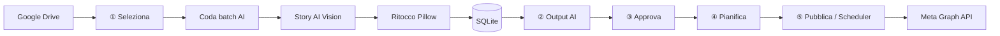

# Social Media Automation — Documentazione completa del progetto

Documento di riferimento per **Story Food & Drink**: architettura, flussi operativi, configurazione, database, UI e troubleshooting.

> **Pipeline principale (2026):** Google Drive → Story AI (ritocco + copy) → approvazione manuale → pianificazione slot → pubblicazione Meta (Instagram + Facebook).  
> Il modulo **Canva** resta nel repository come percorso **legacy** opzionale.

---

## Indice

1. [Panoramica](#1-panoramica)
2. [Architettura e flusso dati](#2-architettura-e-flusso-dati)
3. [Struttura del repository](#3-struttura-del-repository)
4. [Configurazione](#4-configurazione)
5. [Story AI Assistant](#5-story-ai-assistant)
6. [Elaborazione immagini](#6-elaborazione-immagini)
7. [Database SQLite](#7-database-sqlite)
8. [Interfaccia web (React)](#8-interfaccia-web-react)
9. [Interfaccia Streamlit (legacy)](#9-interfaccia-streamlit-legacy)
10. [Code batch e processi in background](#10-code-batch-e-processi-in-background)
11. [Pianificazione e pubblicazione Meta](#11-pianificazione-e-publicazione-meta)
12. [Google Drive](#12-google-drive)
13. [Docker](#13-docker)
14. [CLI](#14-cli)
15. [Variabili d'ambiente](#15-variabili-dambiente)
16. [Cartelle di output](#16-cartelle-di-output)
17. [Percorsi legacy (Canva)](#17-percorsi-legacy-canva)
18. [Test](#18-test)
19. [Troubleshooting](#19-troubleshooting)
20. [Sicurezza e segreti](#20-sicurezza-e-segreti)

---

## 1. Panoramica

### Obiettivo

Automatizzare la produzione e la pubblicazione di contenuti social per **Story Food & Drink** (Pagani): selezione foto da Google Drive, miglioramento leggero con AI, generazione caption/hashtag allineati al brand, approvazione umana, pianificazione su calendario editoriale e dispatch verso **Instagram** e **Facebook Page** via **Meta Graph API**.

### Principi del brand (Story AI)

- Story **non vende hamburger**: vende compagnia, momenti condivisi, appartenenza, community.
- Il cibo è il mezzo; la relazione è il prodotto.
- Feed = **solo fotografia**, senza overlay grafici Canva nel flusso principale.
- Hashtag principale: `#TuttaNataStory`.
- Editing fotografico **invisibile** (crop leggero, esposizione, contrasto, nitidezza).

### Componenti runtime

| Componente | Tecnologia | Ruolo |
|------------|------------|--------|
| UI | React + TypeScript (`frontend/`) | Flusso guidato a step (default) |
| API | FastAPI (`src/social_automation/api/`) | REST + SSE batch |
| UI legacy | Streamlit (`web/app.py`, extra `[ui]`) | Deprecata, profile Docker `streamlit` |
| Backend | Python 3.11+ | Pipeline, scheduling, worker batch |
| DB | SQLite (`output/social_automation.db`) | Stato immagini, batch, pianificazione |
| Story AI | OpenAI-compatible Vision API | Ritocco JSON + copy pack |
| Ritocco locale | Pillow | Crop + aggiustamenti da JSON AI |
| Drive | Google Drive API v3 | Listing e download immagini |
| Pubblicazione | Meta Graph API | Post IG/FB, story, scheduling |
| Scheduler | Docker / launchd | `dispatch-scheduled` periodico |
| Qualità (opz.) | ONNX | Gate qualità immagine (non usato in Approva Story) |

---

## 2. Architettura e flusso dati

### Flusso principale Story AI (UI)



### Dettaglio elaborazione singola foto

Per ogni asset selezionato, `process_drive_asset()` esegue:

1. **Download** da Drive → `output/drive_{file_id}.jpg`
2. **Normalizzazione EXIF** (orientamento smartphone)
3. **Chiamata 1 — Ritocco** (`run_retouch_analysis`): analisi visiva + JSON `light_adjustments`
4. **Applicazione ritocchi** con Pillow → `output/processed/{ig|fb|stories}/`
5. **Chiamata 2 — Copy** (`generate_copy_pack`) sulla foto **già ritoccata**
6. **Salvataggio DB**: `images`, `metadata`, `copy_json`, `retouch_json`
7. **Approvazione**: `auto_approve=False` in coda UI → `is_valid_for_publication = NULL` (in attesa step ③)

### Flusso legacy Canva (opzionale)

Drive → template Canva → export PNG/JPG → DB. Non è il percorso default della UI Story; moduli in `canva/`, comandi `canva-render-test`, pagine automazione legacy.

---

## 3. Struttura del repository

```
social-media-automation/
├── config/                          # Configurazione operativa (montata in Docker)
│   ├── brand/
│   │   ├── story_agent.yaml         # Prompt agente Story AI (ritocco, copy)
│   │   ├── Story_Food_Drink_AI_Knowledge_Base_v1.2.md
│   │   └── Story_AI_Knowledge_Base_v1.2.md  # symlink al file sopra
│   ├── categories.yaml              # Root Drive + categorie business
│   ├── schedule.yaml                # Slot editoriali IG/FB
│   ├── vision_brand.yaml            # Prompt validazione vision (gate dispatch)
│   └── canva.yaml                   # Template Canva (legacy)
├── src/social_automation/
│   ├── web/
│   │   ├── app.py                   # UI Streamlit principale
│   │   └── selected_ai_batch_runner.py  # Worker coda Story AI
│   ├── workflow/
│   │   ├── process_photo.py         # Drive → Story AI → DB
│   │   └── render.py                # Selezione asset Canva legacy
│   ├── brand/                       # Story AI Assistant
│   │   ├── loader.py                # Carica YAML + KB
│   │   ├── agent.py                 # run_retouch_analysis, generate_copy_pack
│   │   ├── openai_json.py           # Chiamate Vision API → JSON
│   │   └── copy_pack.py             # Caption + hashtag da copy_json
│   ├── processing/
│   │   └── image_adjust.py          # Pillow: EXIF, crop, ritocchi
│   ├── drive/                       # OAuth + client Drive
│   ├── db/store.py                  # Schema SQLite + query
│   ├── meta/                        # Client Graph API, OAuth token
│   ├── scheduling/                  # Slot, prepare-week, dispatch
│   ├── validation/                  # Gate vision brand
│   ├── canva/                       # Legacy Canva Connect
│   ├── cli.py                       # Entry point CLI
│   └── settings.py                  # Pydantic settings da .env
├── output/                          # DB, render, cache, log (gitignored in parte)
├── models/image-quality/            # Modello ONNX opzionale
├── docs/                            # Documentazione
├── docker-compose.yml
├── Dockerfile
├── pyproject.toml
├── .env                             # Segreti (non committare)
├── credentials.json                 # OAuth Google (non committare)
└── token.json                       # Token Google (non committare)
```

---

## 4. Configurazione

### File obbligatori / consigliati

| File | Descrizione |
|------|-------------|
| `.env` | API key, path token, gate dispatch |
| `credentials.json` | Client OAuth Google (Desktop) |
| `token.json` | Token refresh Google Drive |
| `config/categories.yaml` | ID cartella root Drive + categorie (`food`, `beer`, …) |
| `config/schedule.yaml` | Slot fissi per pianificazione |
| `config/brand/story_agent.yaml` | Prompt Story AI |
| `config/brand/Story_Food_Drink_AI_Knowledge_Base_v1.2.md` | Knowledge base brand |

### `config/categories.yaml`

Struttura Drive tipica:

```
{root}/
  2026/
    Aprile/
      food/
      beer/
      peppe/
      locale/
```

Campi principali:

- `drive_root_folder_id`: ID cartella root (da URL Drive `.../folders/ID`)
- `raw_categories`: elenco categorie riconosciute nel path
- `category_aliases`: mappa nomi cartella → categoria business normalizzata

Il listing in UI filtra per **anno + mese + categoria**. Se le foto sono in Aprile e il filtro è sul mese corrente (es. Giugno), l'elenco risulta vuoto.

### `config/schedule.yaml`

Definisce slot editoriali ricorrenti:

- `timezone`: es. `Europe/Rome`
- `slots[]`: `platforms`, `weekday`, `time`, `category`

Usato dallo step **④ Pianifica** per suggerire il prossimo slot libero.

### `config/vision_brand.yaml`

Prompt per il **gate vision** al momento del dispatch (non per Story AI copy). Controllato da `DISPATCH_REQUIRE_VISION_PASS`.

---

## 5. Story AI Assistant

### Due file di istruzioni

Il sistema combina **config strutturata** + **knowledge base markdown**:

| File | Contenuto | Uso nel codice |
|------|-----------|----------------|
| `config/brand/story_agent.yaml` | Identità agente, regole JSON, prompt ritocco/copy | `load_story_agent_config()` |
| `config/brand/Story_Food_Drink_AI_Knowledge_Base_v1.2.md` | Brand identity, tone of voice, pillar, copy rules | Append al system message |

Caricamento (`src/social_automation/brand/loader.py`):

```python
build_system_message(cfg) =
    cfg.system_preamble
    + "--- KNOWLEDGE BASE ---"
    + cfg.knowledge_text
```

Path configurabili in `.env`:

- `STORY_AGENT_CONFIG_PATH` (default: `config/brand/story_agent.yaml`)
- `BRAND_KNOWLEDGE_PATH` (default: `config/brand/Story_Food_Drink_AI_Knowledge_Base_v1.2.md`)

### Campi YAML e mapping modalità GPT

| Campo YAML | Modalità concettuale | Funzione Python | Quando viene usato |
|------------|---------------------|-----------------|-------------------|
| `system_preamble` | System prompt | `build_system_message()` | Ogni chiamata Vision |
| `retouch_prompt` | `/edit` + `/art` | `run_retouch_analysis()` | Fase 1: analisi + parametri ritocco |
| `copy_prompt` | `/copy` | `generate_copy_pack()` | Fase 2: caption, CTA, hashtag |
| `auto_prompt` | `/auto` monolitico | `run_auto_pack()` | Legacy; **non** usato dalla coda UI attuale |

La coda UI usa **Visual Producer V2** (review → asset finale → copy), equivalente al workflow `/auto` descritto nelle istruzioni originali del GPT custom.

### Visual Producer V2 (2026)

Pipeline in `src/social_automation/visual/`:

1. **Visual Review** (`run_visual_review`) — Vision API valuta la foto (score 0–10, `needs_editing`, formato suggerito).
2. **Decision engine** (`decision_engine`) — soglie configurabili:
   - score ≥ `VISUAL_REVIEW_SCORE_USE_ORIGINAL` (default **8.0**) → usa **originale** (solo normalizzazione EXIF/crop se necessario)
   - score tra soglia manuale e 8 → **AI image edit** (`gpt-image-1` via `/images/edits`) con prompt da `config/brand/visual_producer_prompt.md`
   - score < `VISUAL_REVIEW_SCORE_MANUAL` (default **5.0**) → **Pillow fallback** (ritocco JSON legacy) + flag revisione manuale
3. **Copy pack** (`generate_copy_pack`) — sulla **immagine finale** (originale, AI edit o Pillow).

Metadata workflow: `mode: story_ai_v2`. Colonne DB aggiuntive: `visual_score`, `visual_status`, `editing_required`, `original_path`, `generated_image_path`.

| Variabile `.env` | Default | Ruolo |
|------------------|---------|-------|
| `VISUAL_IMAGE_MODEL` | `gpt-image-1` | Modello OpenAI image edit |
| `VISUAL_IMAGE_SIZE` | (auto) | Dimensione output edit |
| `VISUAL_REVIEW_SCORE_USE_ORIGINAL` | `8.0` | Soglia “usa originale” |
| `VISUAL_REVIEW_SCORE_MANUAL` | `5.0` | Sotto questa soglia → revisione manuale |
| `VISUAL_PRODUCER_PROMPT_PATH` | `config/brand/visual_producer_prompt.md` | Istruzioni edit AI |

In UI: **② Output AI** mostra Visual Score e status; **③ Approva** mostra copy completo (IG/FB, story, CTA, hashtag) e confronto originale vs asset finale.

### Chiamate API OpenAI

Implementate in `src/social_automation/brand/openai_json.py`:

- Endpoint: `VISION_API_BASE_URL` o default `https://api.openai.com/v1`
- Modello: `VISION_MODEL` (es. `gpt-4o-mini`, `gpt-4o`)
- Chiave: `VISION_API_KEY`
- Per OpenAI nativo: `response_format: { type: "json_object" }`
- Input: immagine in base64 + prompt testuale
- Output: JSON parsato (ritocco o copy)

### JSON ritocco atteso (`light_adjustments`)

```json
{
  "crop_mode": "instagram_4_5",
  "exposure": 0.05,
  "contrast": 0.02,
  "sharpness": 0.08,
  "saturation": 0.0
}
```

Valori numerici obbligatori. Il codice in `image_adjust.py` converte stringhe non numeriche in `0.0` (fallback).

### JSON copy atteso (`copy_json`)

```json
{
  "instagram_caption": "...",
  "facebook_caption": "...",
  "story_text": "...",
  "cta": "...",
  "hashtags": ["#TuttaNataStory", "..."],
  "content_pillar": "food",
  "final_review": { "status": "APPROVED", "notes": "..." }
}
```

---

## 6. Elaborazione immagini

### EXIF e orientamento

Le foto iPhone salvano spesso i pixel “sideways” con tag EXIF Orientation. Google Drive applica EXIF nel viewer; Pillow no, se non configurato.

Il progetto normalizza EXIF in:

- Download Drive (`process_drive_asset`)
- Cache anteprime UI (`output/drive_cache/exif/`)
- Pipeline ritocco (`apply_adjustments`)

Dopo la normalizzazione il JPEG viene salvato **senza tag EXIF** per evitare doppia rotazione nel browser.

### Crop e dimensioni export

`src/social_automation/processing/image_adjust.py` applica **center crop** al formato social:

| Piattaforma | Formato | Dimensioni | `crop_mode` |
|-------------|---------|------------|-------------|
| Instagram | Post | 1080×1350 (4:5) | `instagram_4_5` |
| Facebook | Post | 1200×900 | `facebook_context` |
| IG/FB | Story | 1080×1920 (9:16) | `story_9_16` |

Il crop **non preserva** il formato originale: una foto orizzontale elaborata come Post IG perde i lati; una verticale come Post FB perde sopra/sotto. È intenzionale per i formati feed.

### Output processati

```
output/processed/
├── ig/           # Post Instagram
├── fb/           # Post Facebook
└── stories/      # Story (condivise IG+FB)
```

Naming file: `{categoria}_{drive_file_id}.jpg` (con suffisso `_story` per story).

---

## 7. Database SQLite

Path default: `output/social_automation.db` (`DB_PATH` in `.env`).

### Tabella `images`

| Colonna | Significato |
|---------|-------------|
| `id` | PK immagine |
| `name` | Nome display |
| `path` | Path file processato (UNIQUE) |
| `render_ig`, `render_fb`, `render_ig_story`, `render_fb_story` | Flag piattaforma/formato |
| `is_valid_for_publication` | `NULL`=da approvare, `1`=ok, `0`=rifiutata |
| `copy_json` | Copy pack Story AI (JSON) |
| `retouch_json` | Parametri ritocco AI (JSON) |
| `is_valid_by_quality_evaluation` | Gate ONNX (opzionale) |
| `vision_eval_pass`, `vision_eval_reason` | Esito review vision |

### Tabella `metadata`

Una riga per ogni elaborazione: `platform`, `media_format`, `source_file`, `source_asset_id`, `business_category`, ecc.

### Tabella `planning_events`

Storico append-only: pianificazione e pubblicazione (`scheduled_for`, `external_id` Meta, `event_type`).

### Tabelle `batches` / `batch_items`

Monitor code AI:

- `status`: `running`, `completed`, `partial`, `failed`, `cancelled`
- `requested_count`, `completed_count`, `failed_count`
- `last_error`, `runner_pid`
- Item per foto con esito e `image_id`

### Tabella `story_schedule_rules`

Regole ricorrenti/one-shot per story (dispatch separato dai post feed).

---

## 8. Interfaccia web (React)

Stack default dopo la migrazione (2026): **Vite + React 19 + TypeScript + Tailwind** con backend **FastAPI**.

### Sviluppo locale

```bash
pip install -e ".[api,dev]"
uvicorn social_automation.api.main:app --reload --port 8000

cd frontend && npm install && npm run dev
# http://localhost:5173
```

### Docker produzione

```bash
docker compose up -d
# http://localhost:8080  (nginx → React + /api → uvicorn)
```

### Route UI

| Step | Route | Funzione |
|------|-------|----------|
| — | `/` | Dashboard metriche |
| 1 | `/workflow/select` | Drive, multiselect, avvio batch AI |
| 2 | `/workflow/output` | Output AI, progress batch |
| 3 | `/workflow/approve` | Approvazione manuale |
| 4 | `/workflow/plan` | Pianifica + calendario |
| 5 | `/workflow/publish` | Dispatch eventi scaduti |
| — | `/automation` | Prepara settimana + monitor batch |

Documentazione migrazione: `docs/migrazione-fe-react.md`.

---

## 9. Interfaccia Streamlit (legacy)

> Deprecata. Usare React. Disponibile con `pip install -e ".[ui]"` o `docker compose --profile streamlit up -d ui-legacy`.

Avvio:

```bash
pip install -e ".[ui]"
streamlit run src/social_automation/web/app.py
```

### Menu navigazione

| Step | Pagina | Funzione |
|------|--------|----------|
| — | **Home** | Dashboard metriche + scorciatoie |
| 1 | **① Seleziona** | Carica foto Drive, anteprime, multiselect, avvia coda AI |
| 2 | **② Output AI** | Before/after, caption, stato batch |
| 3 | **③ Approva** | Approva / rifiuta manualmente |
| 4 | **④ Pianifica** | Selezione immagini approvate + slot calendario |
| 5 | **⑤ Pubblica** | Dispatch manuale eventi scaduti |
| — | **Automazione** | prepare-week, monitor batch, Canva legacy |

### ① Seleziona — dettaglio

1. Scegli **Categoria**, **Anno**, **Mese**
2. Clic **Carica immagini da Drive**
3. Griglia paginata (12 foto/pagina) con anteprima e checkbox
4. Scegli **Social destinazione** (Instagram/Facebook) e **Formato** (Post/Story)
5. **Avvia coda Story AI** → subprocess batch in background

**Importante:** Social + Formato scelti qui determinano i flag `render_ig` / `render_fb` in DB. In **③ Approva** devi usare gli **stessi filtri** per vedere le foto.

### ② Output AI

- Filtro: da approvare / approvate / rifiutate / tutte
- Sezione **Coda in esecuzione** con barra avanzamento (aggiornamento manuale con pulsante)
- Stati batch: `running`, `completed`, `failed`, …

### ③ Approva

- Mostra solo `is_valid_for_publication IS NULL` + `copy_json` presente
- **Non** applica filtro ONNX (flusso Story)
- Filtri: Social, Formato, Categoria
- Pulsanti Approva / Rifiuta per immagine

### ④ Pianifica

- Solo immagini con `is_valid_for_publication = 1`
- Step 1: selezione con anteprima; Step 2: assegnazione slot
- Usa `config/schedule.yaml`

### ⑤ Pubblica

- Eventi `planning_events` scaduti
- Dispatch reale o dry-run verso Meta

---

## 10. Code batch e processi in background

### Avvio coda (UI)

1. UI crea record in `batches` (`status=running`)
2. Scrive `output/batch_queues/{batch_id}.json` con lista asset
3. Lancia subprocess:

```bash
python -m social_automation.web.selected_ai_batch_runner \
  --batch-id N --queue-file output/batch_queues/N.json
```

4. Worker processa **sequenzialmente** (una foto alla volta)
5. Al primo errore: batch `failed`, stop
6. `auto_approve=False` → tutte le foto vanno in coda approvazione manuale

### Monitoraggio

- **② Output AI** → sezione coda + pulsante Aggiorna
- **Automazione** → Monitor batch (tabella + dettaglio item)
- **Home** → contatore Batch attivi

I log stdout/stderr del worker sono disattivati (`DEVNULL`); gli errori compaiono in `batches.last_error`.

---

## 11. Pianificazione e pubblicazione Meta

### Pianificazione slot

`slot_planner.suggest_next_free_slot()` trova il prossimo slot libero da `schedule.yaml` non già occupato in `planning_events`.

### Dispatch automatico

Container `scheduler` in Docker esegue periodicamente:

```bash
dispatch-scheduled --limit N
```

### Gate dispatch (`.env`)

| Variabile | Default | Effetto |
|-----------|---------|---------|
| `DISPATCH_REQUIRE_APPROVAL` | `true` | Richiede `is_valid_for_publication=1` |
| `DISPATCH_REQUIRE_QUALITY_PASS` | `false` | Gate ONNX (se modello presente) |
| `DISPATCH_REQUIRE_VISION_PASS` | `true` | Gate vision brand |

Implementazione: `src/social_automation/scheduling/dispatch_gates.py`.

### Token Meta

- Page token in `META_PAGE_ACCESS_TOKEN` o file `META_PAGE_TOKEN_FILE`
- OAuth: `meta-oauth-page-token` (vedi `docs/meta-setup.md`)
- Instagram richiede `META_IG_USER_ID`

### TLS / proxy verso Graph

Se compare `CERTIFICATE_VERIFY_FAILED`:

```env
META_GRAPH_HTTP_TRUST_ENV=false
```

Vedi `docs/meta-setup.md` per CA aziendali.

---

## 12. Google Drive

### Autenticazione

- Tipo: OAuth2 **Desktop app**
- Primo login: `python -m social_automation drive-auth`
- macOS Safari: `GOOGLE_OAUTH_BROWSER=safari`
- In Docker: OAuth sul **host**, poi monta `token.json`

### Refresh token

Su `RefreshError` (`invalid_grant`), `drive/auth.py` cancella `token.json` e richiede nuovo login.

### Listing immagini

- Ricorsivo per path `anno/mese/categoria`
- Filtro MIME `image/*`
- Ordinamento per recency configurabile

### Download

Bytes grezzi → normalizzazione EXIF → uso in Story AI o cache anteprima.

---

## 13. Docker

```bash
./scripts/docker-init.sh
docker compose build
docker compose up -d
```

| Servizio | Porta | Ruolo |
|----------|-------|-------|
| `web` | 8080 | React + nginx (proxy `/api`) |
| `api` | — (interno) | FastAPI uvicorn |
| `scheduler` | — | Loop dispatch |
| `ui-legacy` (profile) | 8501 | Streamlit deprecato |
| `cli` (profile) | — | Comandi one-shot |

Volumi montati: `output/`, `config/`, `models/`, `credentials.json`, `token.json`, token Canva.

**Rebuild obbligatorio** dopo modifiche al codice Python (`docker compose up --build`).

Dettagli: `docs/docker.md`.

---

## 14. CLI

Entry point: `python -m social_automation` o `social-automation`.

| Comando | Descrizione |
|---------|-------------|
| `drive-auth` | Login Google Drive |
| `drive-list-images` | Elenco immagini in cartella |
| `drive-list-recent` | Elenco per categoria/recency |
| `story-process` | Processa singola foto Story AI |
| `prepare-week` | Workflow settimanale automatico |
| `dispatch-scheduled` | Pubblica eventi scaduti |
| `meta-oauth-page-token` | OAuth Facebook Page token |
| `meta-refresh-page-token` | Refresh token da user token |
| `canva-auth`, `canva-render-test` | Legacy Canva |
| `image-quality-evaluate` | Valutazione ONNX batch |

Elenco completo: `docs/cli-comandi.md`.

---

## 15. Variabili d'ambiente

Vedi `.env.example`. Principali:

### Story AI

```env
VISION_API_KEY=sk-...
VISION_MODEL=gpt-4o-mini
# VISION_API_BASE_URL=   # opzionale, provider compatibile OpenAI
# STORY_AGENT_CONFIG_PATH=config/brand/story_agent.yaml
# BRAND_KNOWLEDGE_PATH=config/brand/Story_Food_Drink_AI_Knowledge_Base_v1.2.md
```

### Google Drive

```env
GOOGLE_CREDENTIALS_PATH=credentials.json
GOOGLE_TOKEN_PATH=token.json
GOOGLE_DRIVE_FOLDER_ID=          # opzionale se in categories.yaml
GOOGLE_OAUTH_BROWSER=safari      # vuoto in Docker
```

### Meta

```env
META_APP_ID=
META_APP_SECRET=
META_PAGE_TOKEN_FILE=output/meta_page_token.txt
META_IG_USER_ID=
META_GRAPH_HTTP_TRUST_ENV=false   # se problemi TLS/proxy
```

### Database e dispatch

```env
DB_PATH=output/social_automation.db
DISPATCH_REQUIRE_APPROVAL=true
DISPATCH_REQUIRE_QUALITY_PASS=false
DISPATCH_REQUIRE_VISION_PASS=true
DISPATCH_INTERVAL_SECONDS=600
```

---

## 16. Cartelle di output

```
output/
├── social_automation.db      # Database SQLite
├── drive_{file_id}.jpg       # Download grezzo (post-EXIF) per elaborazione
├── drive_cache/
│   └── exif/                 # Anteprime UI (EXIF corretto)
├── batch_queues/
│   └── {batch_id}.json       # Code batch Story AI
├── processed/
│   ├── ig/
│   ├── fb/
│   └── stories/
├── canva-rendered/           # Legacy Canva
│   ├── ig/
│   ├── fb/
│   └── stories/
├── meta_page_token.txt
└── logs/
```

---

## 17. Percorsi legacy (Canva)

Il modulo `canva/` supporta:

- OAuth Canva Connect
- Render template con foto Drive
- Output in `output/canva-rendered/`

Non fa parte del flusso Story AI guidato in UI. Utile per locandine/eventi con template grafici.

---

## 18. Test

```bash
pip install -e ".[dev]"
pytest
```

Suite in `tests/`: DB, process_photo, story flow, dispatch, Canva, Meta hints, ecc.

---

## 19. Troubleshooting

### Nessuna immagine in Drive (0 risultati)

- Verifica **mese/anno** (foto in `Aprile` vs filtro `Giugno`)
- Verifica `drive_root_folder_id` e categoria in `categories.yaml`

### Anteprime ruotate

- Riclicca **Carica immagini da Drive** (rigenera cache `drive_cache/exif/`)
- Oppure: `rm -rf output/drive_cache/*`
- Rebuild Docker se codice non aggiornato

### ② Output AI ok ma ③ Approva vuoto

- Allinea **Social** e **Formato** con quelli usati in coda (es. IG + Post)
- Categoria = **tutte**
- Le foto devono avere `is_valid_for_publication = NULL` (non già approvate/rifiutate)

### Batch `failed`

Controlla **Ultimo errore** in ② Output AI o Automazione → Monitor batch:

| Errore | Causa | Azione |
|--------|-------|--------|
| `CERTIFICATE_VERIFY_FAILED` | VPN/proxy TLS | Disattiva VPN; `META_GRAPH_HTTP_TRUST_ENV=false` per Meta |
| `insufficient_quota` | Credito OpenAI esaurito | Billing OpenAI |
| `could not convert string to float` | JSON ritocco malformato | Prompt aggiornato + fallback numerico in codice |
| `invalid_grant` (Drive) | Token Google scaduto | Rifare `drive-auth` sul host |

### Coda ferma su `0/N`

- Normale per i primi minuti (prima foto in elaborazione)
- Clic **Aggiorna stato coda**
- Verifica credito OpenAI e assenza VPN

### Copy simili tra foto

- Story AI usa KB brand forte → tono coerente
- Copy generato **per foto** sulla versione ritoccata; devono differire nei dettagli visibili
- Prova `VISION_MODEL=gpt-4o` per maggiore varietà

---

## 20. Sicurezza e segreti

**Non committare mai:**

- `.env`
- `credentials.json`, `token.json`, `canva_token.json`
- `output/meta_page_token.txt`
- Chiavi API in chiaro

In Docker i segreti arrivano via volumi/env montati dal host, non baked nell'immagine.

---

## Riferimenti incrociati

| Documento | Contenuto |
|-----------|-----------|
| [README.md](../README.md) | Setup rapido |
| [docs/docker.md](docker.md) | Container e volumi |
| [docs/meta-setup.md](meta-setup.md) | Meta OAuth e permessi |
| [docs/cli-comandi.md](cli-comandi.md) | Tutti i comandi CLI |
| [docs/instagram_graph_api_scheduler_notes.md](instagram_graph_api_scheduler_notes.md) | Note scheduling IG |

---

*Ultimo aggiornamento documento: Giugno 2026 — flusso Story AI guidato + Visual Producer V2 (review → asset finale → copy).*
