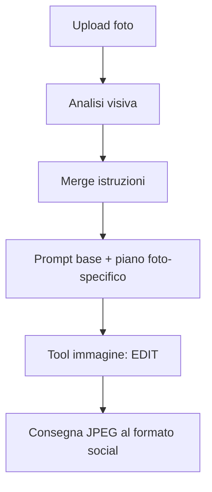

# Parità Visual Producer ↔ Custom GPT (Story AI Assistant)

Documento operativo per allineare il **tool** (`src/social_automation/visual/`) al comportamento osservato del **Custom GPT ChatGPT Plus** con KB brand, a partire dalle evidenze raccolte nei test di giugno 2026.

> **Obiettivo:** l'output deve sembrare *«la stessa foto scattata meglio»* (edit Lightroom), non una nuova immagine AI.

---

## Indice

1. [Sintesi esecutiva](#1-sintesi-esecutiva)
2. [Evidenze dai test GPT](#2-evidenze-dai-test-gpt)
3. [Pattern confermato del GPT](#3-pattern-confermato-del-gpt)
4. [Stato attuale del tool](#4-stato-attuale-del-tool)
5. [Architettura target](#5-architettura-target)
6. [Step di implementazione](#6-step-di-implementazione)
7. [Schema JSON — piano editing](#7-schema-json--piano-editing)
8. [Prompt e layering](#8-prompt-e-layering)
9. [Parametri API immagine](#9-parametri-api-immagine)
10. [Formato per canale (parametrico)](#10-formato-per-canale-parametrico)
11. [Configurazione `.env`](#11-configurazione-env)
12. [Checklist di validazione](#12-checklist-di-validazione)
13. [Limiti noti (non replicabili via API)](#13-limiti-noti-non-replicabili-via-api)
14. [Riferimenti nel codice](#14-riferimenti-nel-codice)

---

## 1. Sintesi esecutiva

Il Custom GPT **non** ottiene risultati migliori grazie a un prompt template diverso: usa lo **stesso testo base** del progetto (`config/brand/image_edit_task_prompt.md`).

Il vantaggio sta nel **middle layer**:

```
Foto → Analisi visiva (per questa immagine) → Prompt arricchito → EDIT API → Export
```

Il tool oggi salta l'analisi e invia un prompt **statico per categoria** (`food` → sempre «hamburger»), senza istruzioni di crop/nitidezza specifiche per la foto.

**Gap principale da colmare:** vision pre-edit che produce un *piano editing foto-specifico* iniettato nel prompt prima della chiamata image tool.

---

## 2. Evidenze dai test GPT

### Test A — Persona che mangia (hot dog / panino)

| Campo | Valore osservato |
|-------|------------------|
| Modalità | **EDIT** (non generazione) |
| Formato | Instagram Feed 4:5 → **1080×1350** |
| Passi dichiarati | 6 |
| Analisi | Uomo, volto, cibo, mani |
| Crop mentale | Volto in alto a sinistra; taglia lati e basso; mantieni testa + mani + cibo |
| Nitidezza selettiva | **Volto e cibo** |
| Regolazioni | +0.2 EV, recupero ombre, contrasto leggero |
| Export | JPEG alta qualità 1080×1350 |

### Test B — Hamburger + patatine (piatto statico)

| Campo | Valore osservato |
|-------|------------------|
| Modalità | **EDIT** |
| Formato | Instagram Feed 4:5 → **1080×1350** |
| Passi dichiarati | 7 (contrasto come step separato) |
| Analisi | Burger al centro, patatine a destra, sfondo con bottiglia/bicchiere |
| Crop mentale | Taglia spazio in alto e ai lati; burger centrato; **patatine visibili a destra** |
| Nitidezza selettiva | **Solo hamburger**; sfondo resta morbido/sfocato |
| Elementi da preservare | Bandierina, patatine, forma burger, logo |
| Regolazioni | +0.2 EV su panino/carne; contrasto su pane, carne, formaggio, patatine |

### Audit JSON (Metodo 1 — basso valore tecnico)

Il GPT ha risposto onestamente che **non espone**:

- prompt interno inviato al tool immagine
- endpoint API esatto
- parametri reali (`action`, `quality`, `input_fidelity`)
- layer system nascosti di ChatGPT

**Conclusione:** replicare il GPT non significa copiare la sua «config interna», ma replicare il **workflow dichiarato** negli screenshot operativi (punti 1–4 + passi intermedi).

---

## 3. Pattern confermato del GPT

Su entrambi i test il flusso è identico nella struttura, variabile nei dettagli:



### Layer di istruzioni (ordine di priorità GPT)

1. System instructions OpenAI (non esposte)
2. Tool policies OpenAI (non esposte)
3. **Custom GPT instructions** (builder)
4. **Knowledge base** (`Story_Food_Drink_AI_Knowledge_Base_v1.2.md` e sezioni correlate)
5. Richiesta utente / task editing

### Passi intermedi (sempre presenti, dettagli adattivi)

| Step | Nome | Cosa fa |
|------|------|---------|
| 1 | Analisi | Identifica soggetti, elementi brand, composizione, sfondo |
| 2 | Crop mentale | Decide cosa tagliare e cosa tenere visibile (per questa foto) |
| 3 | Regolazioni globali | ~+0.2 EV, recupero ombre |
| 4 | Contrasto / micro-contrasto | Su texture rilevanti (pane, carne, volto, ecc.) |
| 5 | Nitidezza selettiva | Target **adattivo** (volto+cibo oppure solo cibo) |
| 6 | Pulizia minima | Rimuove micro-distrazioni senza alterare elementi |
| 7 | Export | JPEG al formato finale (es. 1080×1350) |

### Regola chiave sulla nitidezza

| Tipo foto | Target nitidezza | Sfondo |
|-----------|------------------|--------|
| Persona + cibo | Volto **e** cibo | Bokeh invariato |
| Piatto statico | Solo cibo (burger) | **Morbido**, non aumentare DOF artificiale |

Il GPT **non** usa etichette fisse per categoria: decide dopo l'analisi.

---

## 4. Stato attuale del tool

### Già implementato (giugno 2026)

| Elemento | Stato | File / env |
|----------|-------|------------|
| Template prompt editing | ✅ Allineato al GPT | `config/brand/image_edit_task_prompt.md` |
| KB brand nelle instructions | ✅ | `VISUAL_EDIT_INCLUDE_KB=true` |
| `action: edit` forzato | ✅ | `responses_image.py` |
| `input_fidelity: high` | ✅ | `.env` |
| `quality: high` | ✅ | `.env` |
| Size API dinamica per `crop_mode` | ✅ | `image_api_size_for_crop()` |
| Post-crop Pillow di sicurezza | ✅ | `VISUAL_SKIP_POST_CROP=false` |
| Formato prompt parametrico per canale | ✅ | `image_edit_format_label()` |

### Ancora mancante (causa del gap qualitativo)

| Elemento | Stato | Impatto |
|----------|-------|---------|
| Vision pre-edit (piano foto-specifico) | ✅ | Alto |
| Iniezione piano nel prompt edit | ✅ | Alto |
| Soggetto/nitidezza adattivi (non `food` → hamburger) | ✅ | Alto |
| Istruzioni crop geometriche per foto | ✅ | Alto |
| Struttura 6–7 step esplicita nel prompt | ✅ | Medio |
| Preservazione sfondo sfocato (istruzione esplicita) | ✅ | Medio |
| Logging payload API completo (debug) | ✅ | Basso (diagnostica) |
| Validazione A/B manuale GPT vs tool | ⏳ | — |

### Flusso attuale vs target

```
ATTUALE:  Foto → [Vision plan JSON] → [prompt base + piano foto] → EDIT API → [crop Pillow] → output
```

`VISUAL_REVIEW_ENABLED=false` lascia disattivato il routing per score; l'analisi pre-edit è gestita da `run_image_edit_plan()` (`VISUAL_EDIT_PLAN_ENABLED=true`).

---

## 5. Architettura target

```
┌─────────────────────────────────────────────────────────────────┐
│  Layer 1+2: instructions API (system + business rules)          │
│  build_image_edit_instructions()                                │
└─────────────────────────────────────────────────────────────────┘
                              │
┌─────────────────────────────────────────────────────────────────┐
│  Step A — Vision Edit Plan (NUOVO)                              │
│  run_image_edit_plan() → ImageEditPlan JSON                     │
│  Modello: VISION_MODEL (es. gpt-4o-mini)                        │
└─────────────────────────────────────────────────────────────────┘
                              │
┌─────────────────────────────────────────────────────────────────┐
│  Step B — User prompt composito                                 │
│  preamble EDIT + template task + piano foto-specifico           │
│  build_image_edit_user_prompt(..., edit_plan=plan)              │
└─────────────────────────────────────────────────────────────────┘
                              │
┌─────────────────────────────────────────────────────────────────┐
│  Step C — Responses API + image_generation tool                 │
│  action=edit, input_fidelity=high, size per crop_mode           │
└─────────────────────────────────────────────────────────────────┘
                              │
┌─────────────────────────────────────────────────────────────────┐
│  Step D — Post-process                                          │
│  finalize_image_for_crop_mode() → px finali per canale          │
└─────────────────────────────────────────────────────────────────┘
```

**Nota:** lo Step A **non** deve bloccare il flusso con score/routing. Serve solo ad arricchire il prompt (a differenza di `run_visual_review()` che decide se editare o meno).

---

## 6. Step di implementazione

Seguire nell'ordine indicato. Ogni step è verificabile in isolamento.

### ✅ Step 1 — Modello dati `ImageEditPlan`

**Stato:** completato (2026-06)

**File:** `src/social_automation/visual/models.py`

Aggiungere dataclass (o estendere `VisualReview`) con campi:

- `subjects: list[str]`
- `preserve_elements: list[str]`
- `crop_plan: str`
- `sharpness_targets: list[str]`
- `preserve_soft_background: bool`
- `adjustments_notes: str` (EV, ombre, contrasto)
- `reasoning: str`

Metodo `from_dict()` con fallback sicuri.

**Test:** `tests/test_edit_plan_models.py`

---

### ✅ Step 2 — `run_image_edit_plan()`

**Stato:** completato (2026-06)

**File:** `src/social_automation/visual/edit_plan.py`

- Input: `image_path`, `platform`, `media_format`, `business_category`, `settings`
- System: `build_system_message()` (KB inclusa)
- User prompt: chiede **solo JSON** con lo schema della [sezione 7](#7-schema-json--piano-editing)
- Modello: `VISION_MODEL` via `chat_vision_json()`
- Output: `ImageEditPlan`

**Regole nel prompt vision:**

- Priorità crop da KB §16 (persone > momenti > Peppe > food > ambiente)
- Formato target da `image_edit_format_label(platform, media_format)`
- Non decidere se pubblicare o meno (niente score) — solo piano editing
- Rispondere in italiano nei campi testuali

**Test:** mock in `tests/test_edit_plan_integration.py`

---

### ✅ Step 3 — Formattare il piano nel prompt edit

**Stato:** completato (2026-06)

**File:** `src/social_automation/visual/prompts.py` (`format_edit_plan_for_prompt`, `_subject_labels_from_plan`)

Aggiungere `format_edit_plan_for_prompt(plan: ImageEditPlan) -> str` che produce:

```markdown
Piano editing per questa foto (analisi preliminare)
- Soggetti: ...
- Elementi da preservare: ...
- Crop: ...
- Nitidezza selettiva su: ...
- Sfondo: mantieni morbido / n.d.
- Regolazioni: ...

Esegui in ordine:
1. Analisi composizione (già fornita sopra)
2. Crop al formato {format}
3. Regolazioni globali leggere
4. Contrasto / micro-contrasto
5. Nitidezza selettiva
6. Pulizia minima
7. Export finale
```

Modificare `build_image_edit_user_prompt()`:

- Parametro opzionale `edit_plan: ImageEditPlan | None`
- Se presente: append/sezione dedicata dopo il template
- Derivare `{subject}` e `{subject_short}` dal piano quando possibile (non solo da `business_category`)

**Test:** `tests/test_edit_plan_integration.py`

---

### ✅ Step 4 — Integrare nel producer

**Stato:** completato (2026-06)

**File:** `src/social_automation/visual/producer.py`

In `_run_ai_image_edit()`:

1. Chiamare `run_image_edit_plan()` **prima** di `build_image_edit_user_prompt()`
2. Passare `edit_plan` al builder prompt
3. Salvare il piano in metadata/log (`producer_notes` o campo dedicato)
4. Non modificare routing score (`visual_review_enabled` resta indipendente)

Aggiungere setting:

```env
VISUAL_EDIT_PLAN_ENABLED=true
```

**Test:** `tests/test_edit_plan_integration.py`

---

### ✅ Step 5 — Aggiornare template

**Stato:** completato (2026-06)

**File:** `config/brand/image_edit_task_prompt.md` + rinforzo dinamico in `prompts.py` se `preserve_soft_background`

Aggiungere placeholder o sezione:

```markdown
Correzioni vietate (in aggiunta)
nessun aumento artificiale della profondità di campo se lo sfondo è già sfocato
```

---

### ✅ Step 6 — Rimuovere logica soggetto rigida

**Stato:** completato (2026-06)

**File:** `src/social_automation/visual/prompts.py` — `_subject_labels_from_plan()`

---

### ✅ Step 7 — Logging diagnostico

**Stato:** completato (2026-06)

**File:** `src/social_automation/visual/responses_image.py` — flag `VISUAL_EDIT_DEBUG_LOG=true`

---

### ✅ Step 8 — Configurazione e deploy

**Stato:** completato (2026-06)

1. `.env` / `.env.example` aggiornati con `VISUAL_EDIT_PLAN_ENABLED=true`
2. Dopo deploy: `docker compose up --build`
3. Nei log: `Image edit plan: subjects=...` e `Image edit via Responses API ... crop=... size=...`

---

### ⏳ Step 9 — Validazione A/B

**Stato:** da eseguire manualmente

Per ogni foto di riferimento (persona+cibo, burger+patatine, story 9:16):

1. Eseguire Custom GPT → salvare output
2. Eseguire tool con stesso canale/formato
3. Confrontare checklist [sezione 12](#12-checklist-di-validazione)

---

### ✅ Step 11 — Modalità GPT pura + revised_prompt (2026-06)

**Stato:** completato

- `VISUAL_GPT_PURE_MODE=true`: originale → Responses API → output diretto
- Disabilita edit plan, pre-crop, compiler, tono Pillow, post-crop
- Log e DB: `revised_prompt` (prompt che gpt-5.5 passa a gpt-image-1.5)

---

## 7. Schema JSON — piano editing

Prompt vision da usare in `run_image_edit_plan()`:

```json
{
  "subjects": ["persona", "hot dog", "logo"],
  "preserve_elements": ["logo maglietta", "bandierina", "patatine"],
  "crop_plan": "Descrizione crop per il formato target, in italiano, specifica per questa foto.",
  "sharpness_targets": ["volto", "cibo"],
  "preserve_soft_background": true,
  "adjustments_notes": "+0.2 EV, recupero ombre leggere, contrasto leggero su soggetto",
  "light_adjustments": {
    "exposure": 0.08,
    "contrast": 0.04,
    "saturation": 0.0,
    "sharpness": 0.0
  },
  "reasoning": "Breve sintesi dell'analisi"
}
```

### Esempi attesi

**Persona che mangia:**

```json
{
  "subjects": ["persona", "cibo"],
  "preserve_elements": ["logo"],
  "crop_plan": "Volto in alto a sinistra; elimina spazio ai lati e in basso; mantieni testa, mani e cibo visibili.",
  "sharpness_targets": ["volto", "cibo"],
  "preserve_soft_background": true,
  "adjustments_notes": "+0.2 EV, recupero ombre, contrasto leggero"
}
```

**Burger + patatine:**

```json
{
  "subjects": ["hamburger", "patatine"],
  "preserve_elements": ["bandierina", "patatine", "logo"],
  "crop_plan": "Centra l'hamburger; mantieni patatine visibili a destra; taglia spazio in alto e ai lati.",
  "sharpness_targets": ["hamburger"],
  "preserve_soft_background": true,
  "adjustments_notes": "+0.2 EV su panino e carne; micro-contrasto su pane, carne, formaggio e patatine"
}
```

---

## 8. Prompt e layering

### Mapping GPT → tool

| Layer GPT | Equivalente tool | Stato |
|-----------|------------------|-------|
| Custom instructions | `story_system.md` + builder GPT | ✅ Layer 1 |
| Knowledge base | `story_business_rules.md` | ✅ Layer 2 via instructions |
| Analisi pre-edit | `run_image_edit_plan()` | ✅ |
| Task editing | `image_edit_task_prompt.md` | ✅ |
| Preamble EDIT | `_IMAGE_EDIT_API_PREAMBLE` | ✅ |
| Piano foto-specifico | `format_edit_plan_for_prompt()` | ✅ |

### Ordine finale del user prompt (target)

```
1. EDIT preamble (inglese, per API)
2. Image Editing Task template renderizzato ({format}, {channels}, …)
3. Piano editing per questa foto (da vision)
4. Lista 7 step operativi
```

### Instructions API (target)

```
build_system_message() = story_system.md + story_business_rules.md
```

Con `VISUAL_EDIT_INCLUDE_KB=true` (già default).

---

## 9. Parametri API immagine

Allineamento consigliato (già in gran parte applicato):

| Parametro | Valore | Note |
|-----------|--------|------|
| Backend | `responses` | `VISUAL_IMAGE_BACKEND=responses` |
| Mainline | `gpt-5.5` | `VISUAL_RESPONSES_MODEL` |
| Image model | `gpt-image-1.5` | Non `gpt-image-2` (rigenera di più) |
| `action` | **`edit`** | Mai `auto` in produzione |
| `input_fidelity` | **`high`** | Preserva volti, loghi, bandierine |
| `quality` | **`high`** | |
| `output_format` | `jpeg` | GPT dichiara JPEG finale |
| `size` | dinamico per `crop_mode` | Vedi tabella sotto |

### Size API per crop_mode

`gpt-image-1.5` supporta solo **1:1, 2:3, 3:2** o **`auto`** — non esiste un 4:5 nativo (`1024×1280`). Per Instagram/Facebook usare **`auto`** dopo un **pre-crop deterministico** della sorgente al ratio target (`precrop_source_for_api`).

| crop_mode | Formato finale | size API | Pre-crop sorgente |
|-----------|----------------|----------|-------------------|
| `instagram_4_5` | 1080×1350 | `auto` | sì (4:5) |
| `story_9_16` | 1080×1920 | `1024x1792` | opzionale |
| `facebook_context` | 1200×900 | `auto` | sì (4:3) |

Override globale solo se necessario: `VISUAL_IMAGE_SIZE=...`

Post-process Pillow (`finalize_image_for_crop_mode`) porta alle dimensioni esatte in pixel. Con pre-crop + `auto`, il post-process dovrebbe fare **solo resize**, non center crop.

### Center crop ≠ luci/colori

Il **center crop** (Pillow) taglia pixel ai bordi: cambia **composizione/inquadratura**, non esposizione, bilanciamento del bianco o grading colore. Un resize leggero può ridurre marginalmente la nitidezza percepita.

Il gap visivo rispetto al Custom GPT (tono, luce, «stessa foto scattata meglio») dipende soprattutto dal **modello image edit** e dal **piano vision**, non dal crop Pillow in post.

---

## 10. Formato per canale (parametrico)

Il formato **non è fisso**: deriva da `platform` + `media_format` scelti in UI/batch.

| Selezione UI | `crop_mode` | Label prompt | Pixel finali |
|--------------|-------------|--------------|--------------|
| Instagram Post | `instagram_4_5` | Instagram Feed 4:5 (1080×1350) | 1080×1350 |
| Instagram Story | `story_9_16` | Story 9:16 (1080×1920) | 1080×1920 |
| Facebook Post | `facebook_context` | Facebook Post (1200×900) | 1200×900 |

La lista `channels` (Instagram + Facebook) riguarda soprattutto il **copy pack**, non il formato immagine. Un batch produce **un asset per** `platform` + `media_format` selezionati.

Il piano vision deve ricevere `platform` e `media_format` e produrre `crop_plan` coerente con il formato target.

---

## 11. Configurazione `.env`

### Produzione (parità GPT — stato attuale + prossimi step)

```env
# Flusso editing
VISUAL_USE_AI_IMAGE_EDIT=true
VISUAL_DISABLE_PILLOW_RETOUCH=true
VISUAL_PRODUCE_MODE=generative
VISUAL_REVIEW_ENABLED=false

# Parità GPT (già applicato)
VISUAL_EDIT_INCLUDE_KB=true
VISUAL_SKIP_POST_CROP=false
VISUAL_IMAGE_BACKEND=responses
VISUAL_RESPONSES_MODEL=gpt-5.5
VISUAL_RESPONSES_IMAGE_MODEL=gpt-image-1.5
VISUAL_IMAGE_INPUT_FIDELITY=high
VISUAL_IMAGE_QUALITY=high
VISUAL_IMAGE_SIZE=

# Edit plan (vision pre-edit)
VISUAL_EDIT_PLAN_ENABLED=true
VISUAL_PRECROP_BEFORE_API=true
VISUAL_JPEG_EXPORT_QUALITY=95
# VISUAL_EDIT_DEBUG_LOG=false
```

### Vision (per edit plan)

```env
VISION_API_KEY=...
VISION_MODEL=gpt-4o-mini
```

---

## 12. Checklist di validazione

Per ogni test A/B (GPT vs tool), stessa foto e stesso `platform` + `media_format`:

### Obbligatori

- [ ] Aspect ratio corretto (4:5, 9:16 o 4:3)
- [ ] Pixel finali corretti (1080×1350, 1080×1920, 1200×900)
- [ ] Logo / bandierina invariati (se presenti)
- [ ] Patatine / elementi laterali invariati (se presenti)
- [ ] Nessun artefatto anatomico (dita, denti, mani)
- [ ] Pelle naturale (no «airbrush» AI) su foto con persone
- [ ] Sfondo bokeh non «rifatto» su foto con DOF naturale
- [ ] Look «Lightroom», non «food magazine» o HDR

### Composizione (da piano vision)

- [ ] Soggetto principale centrato come nel piano
- [ ] Elementi citati nel crop plan ancora visibili
- [ ] Nitidezza sui target giusti (volto+cibo vs solo cibo)

### Tecnici

- [ ] Log contiene `action=edit`, `input_fidelity=high`, `crop` e `size` attesi
- [ ] `method=ai_edited` in metadata batch
- [ ] Docker ricostruito dopo deploy (`docker compose up --build`)

---

## 13. Limiti noti (non replicabili via API)

Anche con parità completa, possono restare differenze:

| Elemento | Motivo |
|----------|--------|
| System instructions nascoste ChatGPT | Non esposte da OpenAI |
| Riscrittura prompt mainline interna | ChatGPT può ottimizzare il prompt prima del tool |
| Routing automatico `auto` → `edit` | Il tool forza `edit` (potenzialmente più prevedibile) |
| Modelli / tuning non documentati | ChatGPT Plus può usare varianti non identiche all'API |
| Multi-turn refinement | GPT può iterare se l'utente chiede correzioni |

Se dopo Step 1–9 il gap persiste, valutare:

- backend diretto `images_edits` (`VISUAL_IMAGE_BACKEND=images_edits`)
- pipeline ibrida: crop Pillow deterministico + AI solo per tono/luce

---

## 14. Riferimenti nel codice

| Componente | Percorso |
|------------|----------|
| Template task editing | `config/brand/image_edit_task_prompt.md` |
| Builder prompt | `src/social_automation/visual/prompts.py` |
| Producer orchestration | `src/social_automation/visual/producer.py` |
| Responses API edit | `src/social_automation/visual/responses_image.py` |
| Size per crop | `src/social_automation/processing/image_adjust.py` |
| Post-crop finale | `src/social_automation/visual/postprocess.py` |
| Visual review (legacy score) | `src/social_automation/visual/review.py` |
| Vision edit plan | `src/social_automation/visual/edit_plan.py` |
| KB Layer 1+2 | `config/brand/story_system.md`, `config/brand/story_business_rules.md` |
| Specifica GPT originale | `docs/story-ai-assistant-gpt.md` |

---

## Cronologia

| Data | Nota |
|------|------|
| 2026-06 | Documento creato da evidenze test GPT (persona+cibo, burger+patatine) e audit JSON Metodo 1 |
| 2026-06 | Già applicati nel tool: `action=edit`, KB, size dinamica, post-crop, preamble EDIT |
| 2026-06 | Step 1–8 implementati: `ImageEditPlan`, `run_image_edit_plan`, integrazione producer, debug log |

---

*Prossimo lavoro: Step 9 validazione A/B manuale su foto di riferimento.*
